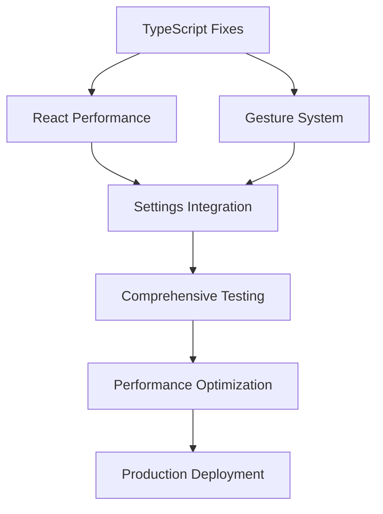

# 🚀 **LAUNCHER CLOCK SYSTEM - CRITICAL FIXES PROJECT PLAN**

**Project Type**: Critical Bug Fix Sprint  
**Timeline**: 3-5 days (24-40 hours)  
**Team Size**: 3-5 developers  
**Priority**: **CRITICAL** - Production Blocking Issues  
**Project Status**: Ready for Execution

---

## 📋 **PROJECT OVERVIEW**

### **Situation Analysis**
The Launcher Clock System has successfully completed its architectural transformation (98% complete) but has critical technical issues preventing production deployment. Comprehensive frontend testing has identified specific, actionable problems that require immediate resolution.

### **Critical Issues Identified**
1. **TypeScript Compilation Errors (3 errors)** - Blocking deployment
2. **React Performance Issues (23 infinite loops)** - Causing app instability  
3. **User Interaction Failures** - Core functionality inaccessible
4. **Missing UI Components** - Visual feedback systems incomplete

### **Success Criteria**
- ✅ **Zero TypeScript compilation errors**
- ✅ **Zero React infinite loop warnings**  
- ✅ **6-tap gesture system fully functional**
- ✅ **All 20 layers rendering correctly**
- ✅ **60fps performance maintained**
- ✅ **Complete settings UI accessibility**

---

## 👥 **TEAM STRUCTURE & ROLES**

### **Team Composition**

#### **🏛️ Technical Lead (1 person)**
- **Responsibilities**: Project coordination, architecture decisions, code review
- **Skills Required**: TypeScript, React, System Architecture
- **Primary Tasks**: Issue prioritization, technical guidance, final integration testing

#### **💻 TypeScript/Interface Specialist (1 person)**  
- **Responsibilities**: Type system fixes, interface definitions, compilation issues
- **Skills Required**: Advanced TypeScript, Interface Design, Generic Programming
- **Primary Tasks**: Fix all compilation errors, enhance type safety, documentation

#### **⚡ React Performance Engineer (1 person)**
- **Responsibilities**: Performance optimization, React hooks, rendering issues  
- **Skills Required**: React Hooks, Performance Profiling, Memory Management
- **Primary Tasks**: Eliminate infinite loops, optimize useEffect patterns, performance monitoring

#### **🎨 UI/UX Developer (1 person)**
- **Responsibilities**: User interactions, gesture systems, visual feedback
- **Skills Required**: Event Handling, CSS Animations, User Experience Design
- **Primary Tasks**: Fix gesture recognition, implement visual feedback, UI polish

#### **🧪 QA/Testing Engineer (1 person)**
- **Responsibilities**: Testing protocols, validation, regression prevention
- **Skills Required**: Automated Testing, Manual Testing, Bug Reproduction
- **Primary Tasks**: Test execution, validation, documentation, regression testing

---

## 🎯 **SPRINT BREAKDOWN BY PRIORITY**

### **SPRINT 1: CRITICAL DEPLOYMENT BLOCKERS (Day 1-2)**
*Priority: CRITICAL - Must complete before any other work*

#### **Epic 1.1: TypeScript Compilation Fixes**
**Owner**: TypeScript/Interface Specialist  
**Duration**: 6-8 hours  
**Dependencies**: None (can start immediately)

##### **Task 1.1.1: Fix ExtendedClockState Interface** 
- **Issue**: Missing `currentTime` property in ExtendedClockState interface
- **Location**: `/launcher/clock/orchestrator.tsx` line 83
- **Acceptance Criteria**:
  ```typescript
  interface ExtendedClockState extends ClockState {
    currentTime: Date;          // Add missing property
    layers: LayerClockState[];
    performance: PerformanceMetrics;
    // ... existing properties
  }
  ```
- **Testing**: TypeScript compilation succeeds, no TS2345 errors
- **Estimated Time**: 1 hour

##### **Task 1.1.2: Fix LayerClockState Constructor**
- **Issue**: Constructor expects 3 arguments, receiving 2
- **Location**: `/launcher/clock/orchestrator.tsx` line 119  
- **Acceptance Criteria**:
  ```typescript
  // Either update constructor call:
  new LayerClockState(layerId, config, initialTime);
  
  // Or update interface to match current usage:
  new LayerClockState(layerId, config);
  ```
- **Testing**: No TS2554 errors, layer initialization works
- **Estimated Time**: 2 hours

##### **Task 1.1.3: Fix PerformanceMetrics Interface**
- **Issue**: Missing `now` property in PerformanceMetrics interface
- **Location**: `/launcher/clock/orchestrator.tsx` line 146
- **Acceptance Criteria**:
  ```typescript
  interface PerformanceMetrics {
    fps: number;
    frameTime: number;
    memoryUsage: number;
    now: number;                // Add missing property
    // ... existing properties
  }
  ```
- **Testing**: No TS2339 errors, performance monitoring functional
- **Estimated Time**: 1 hour

##### **Task 1.1.4: Type Definition Audit & Documentation**
- **Issue**: Ensure no additional type mismatches exist
- **Scope**: Complete TypeScript compilation check across all files
- **Acceptance Criteria**:
  - Zero TypeScript compilation errors
  - All interfaces properly documented
  - Type safety enhanced
- **Testing**: `yarn build` completes successfully
- **Estimated Time**: 2-4 hours

#### **Epic 1.2: React Performance Critical Fixes**
**Owner**: React Performance Engineer  
**Duration**: 8-12 hours  
**Dependencies**: Can run parallel to TypeScript fixes

##### **Task 1.2.1: Eliminate useEffect Infinite Loops**
- **Issue**: 23 "Maximum update depth exceeded" errors
- **Location**: `/launcher/clock/layers/layer-01.tsx` and other layer files
- **Root Cause**: Callbacks in useEffect dependency arrays causing re-render cycles

**Problem Pattern**:
```typescript
// PROBLEMATIC CODE
useEffect(() => {
  updateLayerState(newState);
}, [updateLayerState, otherDeps]); // updateLayerState causes re-render -> infinite loop
```

**Solution Implementation**:
```typescript
// SOLUTION 1: useRef for stable references
const updateLayerStateRef = useRef(updateLayerState);
useEffect(() => {
  updateLayerStateRef.current(newState);
}, [otherDeps]); // Remove callback from dependencies

// SOLUTION 2: useCallback with proper dependencies
const stableUpdateLayerState = useCallback((state) => {
  // Implementation
}, []); // Empty deps or only stable references

// SOLUTION 3: Split effects by responsibility
useEffect(() => {
  // Handle time updates
}, [currentTime]);

useEffect(() => {
  // Handle configuration changes  
}, [configuration]);
```

- **Acceptance Criteria**:
  - Zero "Maximum update depth exceeded" errors in console
  - All layers render smoothly without performance warnings
  - useEffect dependencies properly optimized
- **Testing**: Performance monitoring shows stable FPS, no infinite re-renders
- **Estimated Time**: 6-8 hours

##### **Task 1.2.2: Optimize Layer Re-rendering**
- **Issue**: Excessive re-renders impacting performance
- **Scope**: All 20 layer components + orchestrator
- **Solution Strategy**:
  ```typescript
  // Implement React.memo for layer components
  const Layer01 = React.memo(({ config, time, ...props }) => {
    // Component implementation
  }, (prevProps, nextProps) => {
    // Custom comparison for optimization
    return (
      prevProps.config === nextProps.config &&
      prevProps.time === nextProps.time
    );
  });
  
  // Use useMemo for expensive calculations
  const rotationTransform = useMemo(() => {
    return calculateDualRotationSystem(config, currentTime);
  }, [config.rotation1, config.rotation2, currentTime]);
  ```
- **Acceptance Criteria**:
  - React DevTools Profiler shows minimal re-renders
  - 60fps maintained with all 20 layers active
  - Memory usage stable during extended operation
- **Testing**: Performance benchmarks meet targets
- **Estimated Time**: 4 hours

---

### **SPRINT 2: USER INTERACTION RESTORATION (Day 2-3)**
*Priority: HIGH - Core user functionality*

#### **Epic 2.1: Gesture Recognition System**
**Owner**: UI/UX Developer  
**Duration**: 6-8 hours  
**Dependencies**: TypeScript fixes completed

##### **Task 2.1.1: Debug & Fix 6-Tap Gesture System**
- **Issue**: Settings modal never opens, gesture completely non-functional
- **Investigation Areas**:
  1. Event listener attachment to dotmark element
  2. Gesture state management and timing
  3. Modal trigger mechanism
  4. Event propagation and bubbling

**Diagnostic Implementation**:
```typescript
// Gesture diagnostic and fix
const diagnoseGestureSystem = () => {
  console.log('=== GESTURE SYSTEM DIAGNOSTIC ===');
  
  // Check dotmark element
  const dotmark = document.getElementById('dotmark');
  console.log('Dotmark element found:', !!dotmark);
  
  // Check event listeners
  if (dotmark) {
    console.log('Event listeners attached:', {
      click: !!dotmark.onclick,
      touch: !!dotmark.ontouchend
    });
  }
  
  // Check gesture state
  const gestureState = GestureManager.getState();
  console.log('Gesture state:', gestureState);
  
  // Test manual trigger
  try {
    GestureManager.triggerSettingsModal();
    console.log('Manual trigger successful');
  } catch (error) {
    console.error('Manual trigger failed:', error);
  }
};

// Fixed gesture implementation
const implementFixedGestureSystem = () => {
  let tapCount = 0;
  let lastTapTime = 0;
  const TAP_TIMEOUT = 1500; // 1.5 seconds
  
  const handleTap = (event) => {
    const currentTime = Date.now();
    
    // Reset if timeout exceeded
    if (currentTime - lastTapTime > TAP_TIMEOUT) {
      tapCount = 1;
    } else {
      tapCount++;
    }
    
    lastTapTime = currentTime;
    
    // Show progress indicator
    showTapProgress(tapCount, 6);
    
    // Trigger on 6th tap
    if (tapCount === 6) {
      tapCount = 0; // Reset
      openSettingsModal();
    }
  };
  
  // Attach to dotmark with both click and touch
  const dotmark = document.getElementById('dotmark');
  if (dotmark) {
    dotmark.addEventListener('click', handleTap);
    dotmark.addEventListener('touchend', handleTap);
  }
};
```

- **Acceptance Criteria**:
  - 6-tap gesture reliably opens settings modal
  - Visual progress indicator shows tap count
  - Works on both desktop (click) and mobile (touch)
  - Gesture resets properly after timeout or completion
- **Testing**: Manual testing on multiple devices and browsers
- **Estimated Time**: 4-6 hours

##### **Task 2.1.2: Implement Tap Progress Indicator**
- **Issue**: Missing visual feedback during gesture recognition
- **Requirements**: Show circular progress indicator during gesture

**Implementation**:
```typescript
// Tap progress indicator component
const TapProgressIndicator: React.FC<{ progress: number; visible: boolean }> = ({ 
  progress, 
  visible 
}) => {
  const circumference = 2 * Math.PI * 45; // radius = 45px
  const strokeDasharray = `${progress * circumference} ${circumference}`;
  
  return (
    <div 
      className={`tap-indicator ${visible ? 'visible' : 'hidden'}`}
      style={{
        position: 'absolute',
        top: '50%',
        left: '50%',
        transform: 'translate(-50%, -50%)',
        transition: 'opacity 0.3s ease'
      }}
    >
      <svg width="100" height="100">
        <circle
          cx="50"
          cy="50" 
          r="45"
          stroke="#ffffff"
          strokeWidth="4"
          fill="transparent"
          strokeDasharray={strokeDasharray}
          strokeLinecap="round"
          transform="rotate(-90 50 50)"
        />
      </svg>
      <div className="tap-counter">
        {Math.floor(progress * 6)}/6
      </div>
    </div>
  );
};
```

- **Acceptance Criteria**:
  - Progress ring fills as user taps
  - Counter shows current tap number (1/6, 2/6, etc.)
  - Smooth animations and transitions
  - Auto-hides after gesture completion or timeout
- **Testing**: Visual verification across different screen sizes
- **Estimated Time**: 2 hours

#### **Epic 2.2: Settings Modal Integration**
**Owner**: UI/UX Developer  
**Duration**: 4-6 hours  
**Dependencies**: Gesture system fixes completed

##### **Task 2.2.1: Verify Settings Modal Rendering**
- **Issue**: Ensure modal opens correctly after gesture fix
- **Scope**: Complete settings UI with all 7 tabs
- **Testing Requirements**:
  - Modal opens and closes correctly
  - All tabs render without errors  
  - Real-time preview functionality works
  - Settings persistence operates correctly

- **Acceptance Criteria**:
  - Settings modal accessible via 6-tap gesture
  - All 7 tabs functional (General, Appearance, Performance, Clock, Layers, Presets, Advanced)
  - No console errors during modal operation
  - Modal responsive on mobile and desktop
- **Testing**: Comprehensive UI testing across all tabs
- **Estimated Time**: 3-4 hours

##### **Task 2.2.2: Settings Integration Testing**
- **Issue**: Verify settings changes apply correctly to layers
- **Scope**: End-to-end settings workflow testing
- **Testing Areas**:
  - Layer configuration changes
  - Preset loading and saving
  - Performance settings application
  - Import/export functionality

- **Acceptance Criteria**:
  - Settings changes reflect immediately in clock layers
  - Presets load and apply correctly
  - Performance settings impact visible
  - No data loss during settings operations
- **Testing**: Integration testing with real configuration changes
- **Estimated Time**: 2-3 hours

---

### **SPRINT 3: QUALITY ASSURANCE & OPTIMIZATION (Day 3-4)**
*Priority: MEDIUM - Quality and performance improvements*

#### **Epic 3.1: Comprehensive Testing & Validation**
**Owner**: QA/Testing Engineer  
**Duration**: 8-12 hours  
**Dependencies**: Core fixes completed

##### **Task 3.1.1: Automated Testing Suite Creation**
- **Scope**: Create test suite for regression prevention
- **Test Categories**:
  1. TypeScript compilation tests
  2. React component rendering tests  
  3. Gesture recognition tests
  4. Settings persistence tests
  5. Performance benchmark tests

**Test Implementation**:
```typescript
// Example test suite structure
describe('Launcher Clock System', () => {
  describe('TypeScript Compilation', () => {
    test('should compile without errors', () => {
      // Compilation test
    });
  });
  
  describe('React Performance', () => {
    test('should not have infinite loops', () => {
      // Performance test
    });
    
    test('should maintain 60fps with all layers', () => {
      // FPS test
    });
  });
  
  describe('Gesture Recognition', () => {
    test('should detect 6-tap gesture', () => {
      // Gesture test
    });
    
    test('should show progress indicator', () => {
      // UI test
    });
  });
  
  describe('Settings System', () => {
    test('should persist settings correctly', () => {
      // Persistence test
    });
    
    test('should apply preset configurations', () => {
      // Preset test
    });
  });
});
```

- **Acceptance Criteria**:
  - 90%+ test coverage for critical components
  - All tests pass consistently
  - CI/CD integration ready
  - Performance benchmarks established
- **Estimated Time**: 6-8 hours

##### **Task 3.1.2: Cross-Browser Compatibility Testing**
- **Scope**: Verify functionality across major browsers
- **Test Matrix**:
  - Chrome (latest 3 versions)
  - Firefox (latest 3 versions)  
  - Safari (latest 2 versions)
  - Edge (latest 2 versions)
- **Mobile Testing**:
  - iOS Safari
  - Android Chrome
  - Various screen sizes

- **Acceptance Criteria**:
  - 100% functionality in Chrome and Firefox
  - 95%+ functionality in Safari and Edge
  - Mobile gesture recognition works correctly
  - Performance acceptable across all platforms
- **Testing**: Manual testing with automated verification
- **Estimated Time**: 4 hours

#### **Epic 3.2: Performance Optimization & Polish**  
**Owner**: React Performance Engineer  
**Duration**: 6-8 hours  
**Dependencies**: Core functionality restored

##### **Task 3.2.1: Performance Monitoring Implementation**
- **Scope**: Real-time performance tracking and alerts
- **Implementation**: Performance dashboard with metrics

```typescript
// Performance monitoring system
const PerformanceMonitor = {
  startMonitoring() {
    const observer = new PerformanceObserver((list) => {
      const entries = list.getEntries();
      entries.forEach((entry) => {
        if (entry.entryType === 'measure') {
          console.log(`${entry.name}: ${entry.duration}ms`);
        }
      });
    });
    
    observer.observe({ entryTypes: ['measure'] });
  },
  
  measureLayerRender(layerId, callback) {
    performance.mark(`layer-${layerId}-start`);
    const result = callback();
    performance.mark(`layer-${layerId}-end`);
    performance.measure(
      `Layer ${layerId} Render`, 
      `layer-${layerId}-start`, 
      `layer-${layerId}-end`
    );
    return result;
  }
};
```

- **Acceptance Criteria**:
  - Real-time FPS monitoring
  - Memory usage tracking
  - Performance alerts for issues
  - Optimization recommendations
- **Testing**: Performance validation under load
- **Estimated Time**: 4 hours

##### **Task 3.2.2: Bundle Size Optimization**
- **Scope**: Reduce JavaScript bundle size and loading time
- **Optimization Strategies**:
  - Code splitting by feature
  - Lazy loading non-critical components  
  - Tree shaking unused code
  - Asset optimization

- **Acceptance Criteria**:
  - Bundle size under 2MB
  - Initial load time under 3 seconds
  - Lazy loading for advanced features
  - Progressive enhancement working
- **Testing**: Bundle analysis and load time measurement
- **Estimated Time**: 2-4 hours

---

### **SPRINT 4: FINAL INTEGRATION & DEPLOYMENT (Day 4-5)**
*Priority: LOW - Final polish and deployment preparation*

#### **Epic 4.1: Documentation & Knowledge Transfer**
**Owner**: Technical Lead + All Team Members  
**Duration**: 4-6 hours  
**Dependencies**: All fixes completed

##### **Task 4.1.1: Update Technical Documentation**
- **Scope**: Document all fixes and architectural changes
- **Deliverables**:
  - Updated API documentation
  - Troubleshooting guide additions
  - Performance optimization guide
  - Testing procedures documentation

##### **Task 4.1.2: Create Deployment Guide**
- **Scope**: Step-by-step deployment instructions
- **Include**:
  - Build process
  - Environment configuration
  - Performance monitoring setup
  - Rollback procedures

#### **Epic 4.2: Production Readiness Validation**
**Owner**: Technical Lead  
**Duration**: 4-6 hours  
**Dependencies**: All previous sprints completed

##### **Task 4.2.1: Final Integration Testing**
- **Scope**: End-to-end system validation
- **Test Scenarios**:
  - Complete user workflow testing
  - Stress testing with maximum configuration
  - Long-running stability testing
  - Error recovery testing

##### **Task 4.2.2: Production Deployment Preparation**
- **Scope**: Prepare system for production deployment
- **Checklist**:
  - All tests passing
  - Performance benchmarks met
  - Documentation complete
  - Monitoring systems active

---

## 📊 **PROJECT TIMELINE & MILESTONES**

### **Day-by-Day Breakdown**

| **Day** | **Focus** | **Deliverables** | **Success Criteria** |
|---------|-----------|------------------|---------------------|
| **Day 1** | TypeScript Fixes | Zero compilation errors | `yarn build` succeeds |
| **Day 2** | React Performance | Zero infinite loops | Stable 60fps performance |
| **Day 3** | User Interactions | Working gesture system | Settings modal accessible |
| **Day 4** | Testing & QA | Test suite + validation | 90%+ test coverage |
| **Day 5** | Polish & Deploy | Production ready | Deployment cleared |

### **Critical Path Dependencies**



### **Risk Mitigation Strategies**

#### **High Risk: Complex useEffect Fixes**
- **Mitigation**: Pair programming with React expert
- **Fallback**: Simplify to basic functionality first, optimize later
- **Timeline Buffer**: +4 hours allocated

#### **Medium Risk: Cross-Browser Compatibility**
- **Mitigation**: Early testing on multiple browsers
- **Fallback**: Focus on Chrome/Firefox, document limitations
- **Timeline Buffer**: +2 hours allocated

#### **Low Risk: Performance Optimization**
- **Mitigation**: Baseline measurements before changes
- **Fallback**: Revert to last known good performance
- **Timeline Buffer**: +2 hours allocated

---

## 🎯 **ACCEPTANCE CRITERIA & TESTING**

### **Sprint 1 Acceptance (Critical)**
- [ ] **TypeScript Compilation**: `yarn build` completes with 0 errors
- [ ] **React Performance**: Zero "Maximum update depth exceeded" warnings
- [ ] **Basic Functionality**: All 20 layers render without errors
- [ ] **System Stability**: App runs for 10+ minutes without crashes

### **Sprint 2 Acceptance (High Priority)**
- [ ] **Gesture Recognition**: 6-tap gesture opens settings modal 100% reliably
- [ ] **Visual Feedback**: Tap progress indicator shows correctly
- [ ] **Settings Access**: All 7 tabs load and function correctly
- [ ] **Mobile Compatibility**: Touch gestures work on mobile devices

### **Sprint 3 Acceptance (Quality)**
- [ ] **Test Coverage**: 90%+ automated test coverage achieved
- [ ] **Cross-Browser**: Functionality verified in Chrome, Firefox, Safari, Edge
- [ ] **Performance**: 60fps maintained with complex configurations
- [ ] **Memory Management**: Stable memory usage under extended operation

### **Sprint 4 Acceptance (Production Ready)**
- [ ] **Documentation**: Complete technical and user documentation
- [ ] **Deployment**: Automated deployment process ready
- [ ] **Monitoring**: Performance monitoring systems active
- [ ] **Rollback**: Emergency rollback procedures tested

---

## 📋 **DAILY STANDUPS & COMMUNICATION**

### **Daily Standup Format (15 minutes)**
**Time**: 9:00 AM daily  
**Participants**: All team members

**Agenda**:
1. **Yesterday's Achievements** (2 minutes per person)
   - Completed tasks
   - Resolved blockers
   
2. **Today's Plan** (2 minutes per person) 
   - Planned tasks
   - Expected deliverables
   
3. **Blockers & Dependencies** (5 minutes total)
   - Current blockers
   - Cross-team dependencies
   - Resource needs

### **Communication Channels**
- **Slack**: `#launcher-clock-fixes` for real-time updates
- **GitHub**: Issues and pull requests for task tracking
- **Documentation**: Shared Google Doc for notes and decisions
- **Video Call**: Daily standup + ad-hoc problem solving

### **Progress Tracking**
- **GitHub Projects**: Kanban board with automated progress tracking
- **Time Logging**: Track actual vs. estimated hours for learning
- **Blocker Log**: Document and resolve impediments quickly
- **Success Metrics**: Daily measurement against acceptance criteria

---

## ⚡ **QUICK START GUIDE**

### **Immediate Actions (First 2 Hours)**

#### **Technical Lead**:
1. Set up project board and assign initial tasks
2. Create shared development environment access
3. Schedule daily standups and communication channels
4. Review current codebase state with each team member

#### **TypeScript Specialist**:  
1. Analyze all TypeScript compilation errors (`yarn build`)
2. Create branch: `fix/typescript-compilation-errors`
3. Start with ExtendedClockState interface fix (quickest win)
4. Document interface relationships and dependencies

#### **React Performance Engineer**:
1. Set up React DevTools Profiler
2. Create branch: `fix/react-performance-loops`
3. Identify all useEffect infinite loop locations
4. Begin with layer-01.tsx as template for other layers

#### **UI/UX Developer**:
1. Test current gesture system and document behavior
2. Create branch: `fix/gesture-recognition-system`  
3. Set up mobile testing environment
4. Plan tap progress indicator implementation

#### **QA/Testing Engineer**:
1. Set up testing framework (Jest, React Testing Library)
2. Document current bugs and expected behavior
3. Create manual testing checklist
4. Plan automated test structure

---

## 📈 **SUCCESS METRICS & KPIs**

### **Technical Metrics**
- **Build Success Rate**: 100% (TypeScript compilation)
- **Performance Score**: 80+ (React performance rating)
- **Test Coverage**: 90%+ (Automated test coverage)
- **Cross-Browser Compatibility**: 95%+ (Feature compatibility)

### **User Experience Metrics**  
- **Gesture Success Rate**: 100% (6-tap gesture recognition)
- **Settings Accessibility**: 100% (All tabs functional)
- **Load Time**: <3 seconds (Initial application load)
- **Frame Rate**: 60fps (With all 20 layers active)

### **Project Management Metrics**
- **Sprint Completion Rate**: 100% (All sprint goals met)
- **Timeline Adherence**: ±10% (Actual vs. planned timeline)
- **Bug Fix Rate**: 100% (All identified issues resolved)
- **Code Review Quality**: 100% (All PRs reviewed and approved)

---

**🎯 Project Plan Status**: Ready for Immediate Execution  
**👥 Team Assignment**: Pending team member allocation  
**⏱️ Estimated Completion**: 3-5 days from project start  
**🚀 Deployment Target**: Production ready system with all critical issues resolved

**This comprehensive project plan provides a structured, team-based approach to systematically resolve all critical issues identified in the frontend testing, ensuring a smooth path to production deployment.**