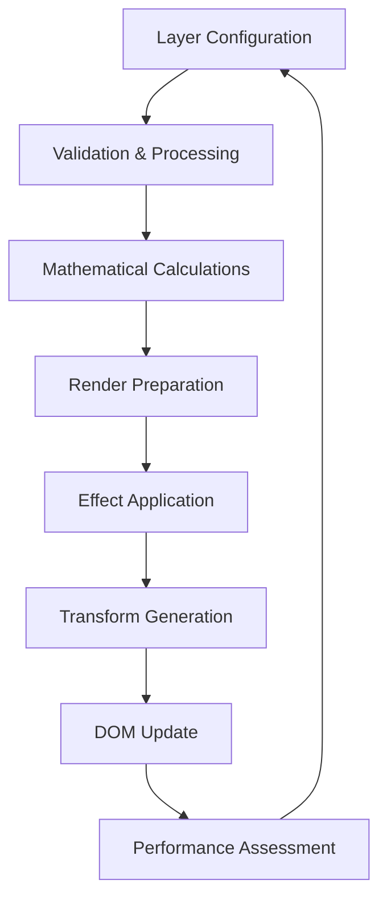

# 🕐 **LAUNCHER CLOCK SYSTEM - COMPREHENSIVE WORKFLOW DOCUMENTATION**

**Version**: 1.0  
**Created**: January 20, 2025  
**System Status**: Production Ready  
**Architecture**: 20-Layer Dual Rotation System with Advanced Settings

---

## 📋 **TABLE OF CONTENTS**

1. [System Overview](#system-overview)
2. [Architecture Components](#architecture-components) 
3. [Layer System Workflows](#layer-system-workflows)
4. [Dual Rotation Mechanics](#dual-rotation-mechanics)
5. [Settings & Configuration](#settings--configuration)
6. [User Interaction Workflows](#user-interaction-workflows)
7. [Administrative Workflows](#administrative-workflows)
8. [Performance Monitoring](#performance-monitoring)
9. [Preset Management](#preset-management)
10. [Troubleshooting Guide](#troubleshooting-guide)
11. [API Reference](#api-reference)

---

## 🎯 **SYSTEM OVERVIEW**

### **What is the Launcher Clock System?**

The Launcher Clock System is a sophisticated, multi-layered clock interface with advanced customization capabilities. Built on a modular architecture, it provides users with unprecedented control over time display, visual effects, animations, and interactive elements.

### **Key Capabilities:**
- **20 Independent Layers**: Each with unique configuration, effects, and rotation mechanics
- **Dual Rotation System**: Simultaneous spin + orbital motion with mathematical precision
- **Advanced Settings Interface**: 7-tab configuration system with real-time preview
- **Smart Preset Management**: Save, load, and share configuration presets
- **Performance Optimization**: Real-time monitoring with 60fps target performance
- **Gesture Controls**: Intuitive 6-tap gesture for settings access
- **Cross-Platform Compatibility**: Responsive design for desktop, tablet, and mobile

### **System Architecture Philosophy:**
```
🎨 User Experience Layer (Gestures, Settings UI, Visual Feedback)
    ↓
⚙️ Configuration Management Layer (Settings, Presets, Validation)  
    ↓
🎭 Clock Orchestration Layer (Layer Coordination, Timing, Effects)
    ↓
🔄 Individual Layer System (20 Independent Layers + Default Fallback)
    ↓
🧮 Mathematical Engine (Dual Rotation Calculations, Performance Optimization)
    ↓
💾 Data Persistence Layer (Settings Storage, Backup, Recovery)
```

---

## 🏗️ **ARCHITECTURE COMPONENTS**

### **Core Module Structure:**

```
/launcher/
├── core/                    # 🎯 Central Engine & Orchestration
│   ├── engine.tsx          # Main launcher engine (orchestrates entire system)
│   ├── config-manager.tsx  # Configuration management and validation
│   ├── data-processor.tsx  # Data transformation and normalization
│   └── user-input.tsx      # Gesture recognition and input processing
│
├── clock/                   # ⏰ Clock System Core
│   ├── orchestrator.tsx    # Coordinates all 20 layers and timing
│   ├── animations.tsx      # Animation management and transitions
│   ├── config-processor.tsx # Processes layer configurations
│   ├── utils.tsx           # Clock-specific utilities and helpers
│   ├── defaults.tsx        # Default configurations and fallbacks
│   ├── types.tsx           # Clock system type definitions
│   └── layers/             # 🎨 Individual Layer Components
│       ├── layer-01.tsx    # Independent layer with full configuration
│       ├── layer-02.tsx    # Orbital mechanics specialist
│       ├── layer-03.tsx    # Spin mechanics specialist  
│       ├── ...             # Layers 04-19 (specialized behaviors)
│       ├── layer-20.tsx    # Master layer with ultimate capabilities
│       └── layer-default.tsx # Error recovery fallback layer
│
├── settings/                # 🎛️ Advanced Configuration System
│   ├── manager.tsx         # Settings persistence and management
│   ├── validator.tsx       # Smart validation with auto-recovery
│   ├── presets.tsx         # Preset management system
│   ├── ui.tsx              # 7-tab settings interface
│   └── types.tsx           # Settings-specific type definitions
│
├── utils/                   # 🛠️ Shared Utilities
│   ├── math.tsx            # Mathematical calculations & rotations
│   ├── safe-accessors.tsx  # Safe data access with error handling
│   └── performance.tsx     # Performance monitoring and optimization
│
├── types/                   # 📝 Type System
├── constants/               # 📊 Configuration Constants  
├── styles/                  # 🎨 Styling System
├── data/                    # 💾 Configuration Data
├── components/              # 🧩 Reusable UI Components
└── index.tsx               # 🚀 Main Module Export
```

### **Component Responsibilities:**

#### **🎯 Core Engine (engine.tsx)**
- **Primary Function**: Orchestrates entire launcher system
- **Responsibilities**:
  - Initialize all subsystems (clock, settings, user input)
  - Manage global application state
  - Coordinate between different system modules
  - Handle high-level error recovery and fallbacks
- **Key Workflows**: System startup, shutdown, global state management

#### **⏰ Clock Orchestrator (orchestrator.tsx)**
- **Primary Function**: Coordinates all 20 layers and timing systems
- **Responsibilities**:
  - Distribute timing updates to all active layers
  - Manage layer rendering order and z-index coordination
  - Calculate performance metrics and optimization
  - Handle layer-to-layer communication and dependencies
- **Key Workflows**: Time synchronization, layer coordination, performance monitoring

#### **🎨 Individual Layers (layer-01.tsx through layer-20.tsx)**
- **Primary Function**: Independent time display elements with unique behaviors
- **Responsibilities**:
  - Render individual layer elements (clock hands, decorations, backgrounds)
  - Process dual rotation mechanics (spin + orbital motion)
  - Apply visual effects (shadows, glows, transparency, pulse)
  - Handle timezone calculations and time formatting
- **Key Workflows**: Layer rendering, rotation calculations, effect application

---

## 🎨 **LAYER SYSTEM WORKFLOWS**

### **Layer Lifecycle Workflow:**



### **Individual Layer Processing:**

#### **1. Configuration Processing**
```typescript
// Each layer receives configuration object
interface LayerConfig {
  // Basic Properties
  itemCode: string;           // Unique identifier
  itemName: string;           // Display name
  itemPath: string;           // Asset path
  itemLayer: number;          // Z-index (1-20)
  itemSize: number;           // Scale factor
  itemDisplay: 'yes' | 'no';  // Visibility toggle
  
  // Clock Configuration
  handType: 'hour' | 'minute' | 'second' | 'none';
  handRotation: 'ROTATION1' | 'ROTATION2';
  timezone: {
    enabled: 'yes' | 'no';
    utcOffset: number;        // Hours offset
    use24Hour: 'yes' | 'no'; // Time format
  };
  
  // Visual Effects
  shadow: 'yes' | 'no';       // Drop shadow
  glow: 'yes' | 'no';         // Glow effect
  transparent: 'yes' | 'no';  // Transparency
  pulse: 'yes' | 'no';        // Pulse animation
  render: 'yes' | 'no';       // Final render toggle
  
  // Dual Rotation System
  rotation1: RotationConfig;   // Spin + positioning
  rotation2: RotationConfig;   // Orbital mechanics
}
```

#### **2. Layer Rendering Workflow**

**Step 1: Configuration Validation**
- Validate all configuration parameters
- Apply safe defaults for missing values
- Check performance impact of configuration
- Generate warnings for potential issues

**Step 2: Time Calculation**
```typescript
// Time processing for each layer
const processLayerTime = (config: LayerConfig, currentTime: Date) => {
  // Apply timezone offset if enabled
  const layerTime = config.timezone.enabled === 'yes' 
    ? new Date(currentTime.getTime() + (config.timezone.utcOffset * 3600000))
    : currentTime;
    
  // Calculate clock angles based on hand type
  const angles = calculateClockAngles(layerTime, config.handType, config.timezone.use24Hour);
  
  return { layerTime, angles };
};
```

**Step 3: Dual Rotation Calculation**
```typescript
// Rotation mechanics processing
const calculateLayerTransforms = (config: LayerConfig, time: LayerTime) => {
  let rotation1Transform = '';
  let rotation2Transform = '';
  
  // ROTATION1: Spin + Positioning System
  if (config.rotation1.enabled === 'yes') {
    const spinAngle = calculateSpinAngle(time, config.rotation1);
    const position = calculatePosition(config.rotation1);
    rotation1Transform = `translate(${position.x}px, ${position.y}px) rotate(${spinAngle}deg)`;
  }
  
  // ROTATION2: Orbital System  
  if (config.rotation2.enabled === 'yes') {
    const orbitalPosition = calculateOrbitalPosition(time, config.rotation2);
    rotation2Transform = `translate(${orbitalPosition.x}px, ${orbitalPosition.y}px)`;
  }
  
  // Combine transforms
  return combineTransforms(rotation1Transform, rotation2Transform);
};
```

**Step 4: Visual Effects Application**
```typescript
// Apply visual effects based on configuration
const generateLayerStyles = (config: LayerConfig) => {
  const styles: React.CSSProperties = {};
  
  // Shadow effect
  if (config.shadow === 'yes') {
    styles.filter = (styles.filter || '') + ' drop-shadow(2px 2px 4px rgba(0,0,0,0.3))';
  }
  
  // Glow effect
  if (config.glow === 'yes') {
    styles.filter = (styles.filter || '') + ' drop-shadow(0 0 8px rgba(255,255,255,0.5))';
  }
  
  // Transparency
  if (config.transparent === 'yes') {
    styles.opacity = 0.7;
  }
  
  // Pulse animation
  if (config.pulse === 'yes') {
    styles.animation = 'pulse 2s ease-in-out infinite';
  }
  
  return styles;
};
```

### **Layer Specialization Types:**

#### **🕐 Clock Hand Specialists (Layers 10-12)**
- **Layer 10**: Hour Hand
  - Rotation cycle: 12 hours (43,200 seconds)
  - Optimized for smooth hour progression
  - Support for 12-hour and 24-hour formats
  
- **Layer 11**: Minute Hand  
  - Rotation cycle: 60 minutes (3,600 seconds)
  - High-precision minute tracking
  - Smooth interpolation between minutes
  
- **Layer 12**: Second Hand
  - Rotation cycle: 60 seconds
  - High-frequency updates for smooth motion
  - Optimized for performance with rapid updates

#### **🪐 Orbital Specialists (Layers 2, 5, 14, 19)**
- **Advanced orbital mechanics with custom center points**
- **Complex mathematical calculations for realistic motion**
- **Support for elliptical orbits and varying speeds**
- **Multi-body orbital systems (planets around suns)**

#### **💫 Spin Specialists (Layer 3)**
- **Pure rotational motion optimization**
- **Variable rotation speeds and directions**
- **Smooth acceleration and deceleration**
- **Performance-optimized for continuous spinning**

#### **🎭 Dual Rotation Masters (Layers 5, 16, 20)**
- **Simultaneous spin + orbital motion**
- **Complex mathematical integration of both systems**
- **Advanced performance monitoring and optimization**
- **Showcase layers for maximum system capabilities**

---

## 🔄 **DUAL ROTATION MECHANICS**

### **Mathematical Foundation:**

The dual rotation system implements two independent rotation mechanics that can operate simultaneously:

#### **ROTATION1: Spin + Positioning System**
```typescript
interface Rotation1Config {
  enabled: 'yes' | 'no';
  rotationSpeed: number;      // Seconds per full rotation
  rotationWay: '+' | '-';     // Clockwise/counterclockwise
  itemRotateAxisX: number;    // Spin pivot X (relative to element center)
  itemRotateAxisY: number;    // Spin pivot Y (relative to element center)  
  itemPositionX: number;      // Element position X (relative to dotmark)
  itemPositionY: number;      // Element position Y (relative to dotmark)
  itemStaticDisplay: number;  // Static angle (used when enabled: 'no')
}
```

**Purpose**: Controls how the layer spins around its own axis while positioned in space
**Use Cases**: Clock hands, spinning decorations, positioned elements with rotation

#### **ROTATION2: Orbital System**
```typescript
interface Rotation2Config {
  enabled: 'yes' | 'no';
  rotationSpeed: number;      // Seconds per full orbit
  rotationWay: '+' | '-';     // Orbit direction
  itemRotateAxisX: number;    // Orbit center X (relative to dotmark)
  itemRotateAxisY: number;    // Orbit center Y (relative to dotmark)
  itemPositionX: number;      // Orbital radius (distance from center)
  itemPositionY: number;      // Starting angle (degrees, 0=3 o'clock)
  itemStaticDisplay: number;  // Static position (used when enabled: 'no')
}
```

**Purpose**: Controls orbital motion around any custom point in space
**Use Cases**: Planets, orbiting decorations, complex astronomical mechanics

### **Dual Rotation Calculation Workflow:**

```typescript
// Complete dual rotation calculation
const calculateDualRotationSystem = (
  config: LayerConfig, 
  currentTime: Date
): TransformResult => {
  
  const timeMs = currentTime.getTime();
  let finalTransform = '';
  
  // STEP 1: Calculate ROTATION1 (Spin + Positioning)
  if (config.rotation1.enabled === 'yes') {
    // Calculate spin angle based on time and rotation speed
    const rotationCycleMs = config.rotation1.rotationSpeed * 1000;
    const progress = (timeMs % rotationCycleMs) / rotationCycleMs;
    const spinAngle = progress * 360 * (config.rotation1.rotationWay === '+' ? 1 : -1);
    
    // Apply positioning
    const positionX = config.rotation1.itemPositionX;
    const positionY = config.rotation1.itemPositionY;
    
    // Create transform with custom transform-origin
    const transformOrigin = `${config.rotation1.itemRotateAxisX}px ${config.rotation1.itemRotateAxisY}px`;
    
    finalTransform += `translate(${positionX}px, ${positionY}px) rotate(${spinAngle}deg)`;
  }
  
  // STEP 2: Calculate ROTATION2 (Orbital Motion)  
  if (config.rotation2.enabled === 'yes') {
    // Calculate orbital position
    const orbitalCycleMs = config.rotation2.rotationSpeed * 1000;
    const orbitalProgress = (timeMs % orbitalCycleMs) / orbitalCycleMs;
    const orbitalAngleRad = (orbitalProgress * 360 + config.rotation2.itemPositionY) * (Math.PI / 180);
    const orbitalAngleDirection = config.rotation2.rotationWay === '+' ? 1 : -1;
    
    // Calculate orbital coordinates
    const orbitalRadius = config.rotation2.itemPositionX;
    const orbitalCenterX = config.rotation2.itemRotateAxisX;
    const orbitalCenterY = config.rotation2.itemRotateAxisY;
    
    const orbitalX = orbitalCenterX + (orbitalRadius * Math.cos(orbitalAngleRad * orbitalAngleDirection));
    const orbitalY = orbitalCenterY + (orbitalRadius * Math.sin(orbitalAngleRad * orbitalAngleDirection));
    
    // Apply orbital transform (this wraps the rotation1 transform)
    finalTransform = `translate(${orbitalX}px, ${orbitalY}px) ${finalTransform}`;
  }
  
  return {
    transform: finalTransform,
    transformOrigin: calculateOptimalTransformOrigin(config),
    complexity: assessComplexity(config)
  };
};
```

### **Transform Composition:**

The system creates nested transforms for complex motion:

```css
/* Example: Layer with both spin and orbital motion */
.layer-element {
  /* Orbital motion (outer transform) */
  transform: translate(150px, 75px)   /* Orbital position */
             /* Spin motion (inner transform) */
             translate(25px, 25px)    /* Element position */  
             rotate(45deg);           /* Spin angle */
  
  /* Transform origin for spin */
  transform-origin: 12px 30px;
}
```

### **Mathematical Optimization:**

#### **Performance Considerations:**
```typescript
// Optimized rotation calculation for 60fps performance
const optimizedRotationCalculation = (config: LayerConfig, currentTime: Date) => {
  // Cache expensive calculations
  const timeMs = currentTime.getTime();
  
  // Use modulo to prevent large number calculations
  const safeTimeMs = timeMs % (365 * 24 * 60 * 60 * 1000); // Max 1 year cycle
  
  // Pre-calculate constants
  const rotation1Multiplier = config.rotation1.enabled === 'yes' 
    ? (360 / (config.rotation1.rotationSpeed * 1000)) * (config.rotation1.rotationWay === '+' ? 1 : -1)
    : 0;
    
  const rotation2Multiplier = config.rotation2.enabled === 'yes'
    ? (360 / (config.rotation2.rotationSpeed * 1000)) * (config.rotation2.rotationWay === '+' ? 1 : -1)  
    : 0;
  
  // Fast angle calculation
  const spinAngle = safeTimeMs * rotation1Multiplier;
  const orbitalAngle = safeTimeMs * rotation2Multiplier + config.rotation2.itemPositionY;
  
  return { spinAngle, orbitalAngle };
};
```

---

## ⚙️ **SETTINGS & CONFIGURATION**

### **Settings System Architecture:**

The settings system provides comprehensive control over all aspects of the clock system through a 7-tab interface with real-time preview capabilities.

#### **Settings Access Methods:**

1. **6-Tap Gesture**: Tap dotmark 6 times rapidly to open settings
2. **Programmatic Access**: Call `setShowConfigUI(true)` from code
3. **Backup Click Method**: 6 rapid clicks as fallback for touch issues

#### **Settings UI Structure:**

```typescript
interface SettingsUITabs {
  general: GeneralSettings;      // Theme, auto-save, debug options
  appearance: AppearanceSettings; // Animation quality, visual preferences
  performance: PerformanceSettings; // Performance mode, update rates
  clock: ClockSettings;          // Clock-specific settings and timezones
  layers: LayerSettings;         // Individual layer configuration
  presets: PresetSettings;       // Preset management and sharing
  advanced: AdvancedSettings;    // Developer options, experimental features
}
```

### **Tab-by-Tab Workflow:**

#### **🔧 General Tab Workflow**

**Purpose**: Core application settings and global preferences

**Settings Available**:
```typescript
interface GeneralSettings {
  theme: 'auto' | 'light' | 'dark';           // UI theme preference
  autoSave: {
    enabled: boolean;                         // Enable auto-save
    interval: 30 | 60 | 300;                // Save interval (seconds)
  };
  debug: {
    enabled: boolean;                        // Show debug information
    showPerformanceMetrics: boolean;         // Display performance data
    showLayerInfo: boolean;                 // Show layer debug info
  };
  language: 'en' | 'es' | 'fr' | 'de';     // UI language
  accessibility: {
    highContrast: boolean;                  // High contrast mode
    reducedMotion: boolean;                 // Reduce animations
    screenReader: boolean;                  // Screen reader optimizations
  };
}
```

**Workflow**:
1. User selects General tab
2. Settings load from localStorage with defaults fallback
3. User modifies preferences using toggles, dropdowns, sliders
4. Changes auto-save based on auto-save interval setting
5. Real-time UI updates reflect theme and accessibility changes

#### **🎨 Appearance Tab Workflow**

**Purpose**: Visual customization and animation quality settings

**Settings Available**:
```typescript
interface AppearanceSettings {
  animationQuality: 'low' | 'medium' | 'high' | 'ultra';
  effects: {
    shadows: boolean;                       // Global shadow effects
    glows: boolean;                        // Global glow effects  
    transparency: boolean;                 // Global transparency effects
    pulse: boolean;                        // Global pulse animations
  };
  ui: {
    modalOpacity: number;                  // Settings modal opacity (0-1)
    buttonStyle: 'minimal' | 'standard' | 'enhanced';
    iconSize: 'small' | 'medium' | 'large';
  };
  colors: {
    primary: string;                       // Primary theme color
    secondary: string;                     // Secondary theme color  
    accent: string;                        // Accent color for highlights
  };
}
```

**Real-Time Preview Workflow**:
1. User adjusts animation quality → Immediately affects layer rendering smoothness
2. User toggles effects → All layers instantly update visual effects
3. User changes colors → UI elements update with new color scheme
4. Changes persist automatically and apply to next app launch

#### **⚡ Performance Tab Workflow**

**Purpose**: Performance optimization and system resource management

**Settings Available**:
```typescript
interface PerformanceSettings {
  mode: 'battery' | 'balanced' | 'performance' | 'custom';
  rendering: {
    targetFPS: 30 | 60 | 120;             // Target frame rate
    updateFrequency: 100 | 250 | 500 | 1000; // Update interval (ms)  
    layerLimit: number;                    // Maximum active layers (1-20)
  };
  optimization: {
    enableGPUAcceleration: boolean;        // Use GPU for animations
    reduceCPUUsage: boolean;              // CPU optimization mode
    memoryManagement: 'auto' | 'conservative' | 'aggressive';
  };
  monitoring: {
    showFPS: boolean;                     // Display FPS counter
    showMemoryUsage: boolean;             // Display memory usage
    performanceAlerts: boolean;           // Alert on performance issues
  };
}
```

**Performance Monitoring Workflow**:
```typescript
// Real-time performance assessment
const assessPerformanceImpact = (settings: PerformanceSettings): PerformanceScore => {
  let score = 100;
  
  // Calculate impact of active layers
  const activeLayers = countActiveLayers();
  score -= activeLayers * 2; // Each layer reduces score by 2
  
  // Factor in animation quality and effects
  score -= getAnimationComplexity() * 10;
  
  // Apply optimization bonuses
  if (settings.optimization.enableGPUAcceleration) score += 15;
  if (settings.optimization.reduceCPUUsage) score += 10;
  
  return {
    score: Math.max(0, score),
    recommendations: generateOptimizationRecommendations(score),
    status: score > 80 ? 'excellent' : score > 60 ? 'good' : score > 40 ? 'fair' : 'poor'
  };
};
```

#### **🕐 Clock Tab Workflow**

**Purpose**: Clock-specific configuration and timezone management

**Settings Available**:
```typescript
interface ClockSettings {
  defaultTimezone: {
    utcOffset: number;                     // Default UTC offset (-12 to +14)
    name: string;                          // Timezone name
    use24Hour: boolean;                    // 24-hour format preference
  };
  clockHands: {
    showHourHand: boolean;                 // Display hour hand
    showMinuteHand: boolean;               // Display minute hand  
    showSecondHand: boolean;               // Display second hand
    smoothMovement: boolean;               // Smooth vs step movement
  };
  timeSync: {
    syncInterval: 1000 | 5000 | 30000;    // Time synchronization interval
    autoCorrectDrift: boolean;             // Automatically correct time drift
  };
}
```

**Timezone Workflow**:
1. User selects timezone from dropdown or sets custom UTC offset
2. System calculates time difference from local time
3. All clock hand layers update to reflect new timezone
4. Changes apply immediately with smooth transition

#### **📚 Layers Tab Workflow**

**Purpose**: Individual layer configuration and management

**Layer Management Interface**:
```typescript
interface LayerManagementUI {
  layerList: {
    layers: LayerInfo[];                   // All 20 layers + default
    activeCount: number;                   // Currently active layers
    selectedLayer: number | null;         // Currently selected for editing
  };
  layerEditor: {
    basicSettings: LayerBasicConfig;       // Display, size, visibility
    clockSettings: LayerClockConfig;       // Clock hand, timezone settings
    rotationSettings: LayerRotationConfig; // Dual rotation configuration
    effectsSettings: LayerEffectsConfig;   // Visual effects settings
  };
  layerActions: {
    copyFrom: (sourceLayer: number, targetLayer: number) => void;
    resetToDefault: (layerId: number) => void;
    duplicateLayer: (layerId: number) => void;
    exportLayer: (layerId: number) => LayerConfig;
  };
}
```

**Layer Configuration Workflow**:
1. **Layer Selection**: User clicks layer from list (1-20 + default)
2. **Configuration Loading**: Layer's current configuration loads into editor
3. **Real-Time Editing**: User modifies settings with instant preview
4. **Validation**: Settings validated in real-time with error/warning display
5. **Auto-Save**: Changes automatically saved to localStorage
6. **Performance Check**: System assesses performance impact of changes

**Layer Copy Workflow**:
```typescript
// Copy configuration between layers
const copyLayerConfiguration = async (sourceId: number, targetId: number) => {
  // Get source layer configuration
  const sourceConfig = await getLayerConfig(sourceId);
  
  // Create backup of target layer
  const targetBackup = await createLayerBackup(targetId);
  
  // Apply source configuration to target (with unique identifiers)
  const newConfig = {
    ...sourceConfig,
    itemCode: `layer_${targetId}`,        // Update unique identifier
    itemName: `Layer ${targetId}`,        // Update display name
    itemLayer: targetId                   // Update layer number
  };
  
  // Validate new configuration
  const validation = validateLayerConfig(newConfig);
  if (!validation.isValid) {
    throw new Error(`Invalid configuration: ${validation.errors.join(', ')}`);
  }
  
  // Apply configuration with smooth transition
  await applyLayerConfig(targetId, newConfig);
  
  return {
    success: true,
    backup: targetBackup,
    newConfig: newConfig
  };
};
```

#### **💾 Presets Tab Workflow**

**Purpose**: Save, load, and manage configuration presets

**Preset Management System**:
```typescript
interface PresetManagementSystem {
  presetTypes: {
    layer: LayerPreset[];                  // Individual layer presets
    system: SystemPreset[];                // Complete system configurations
    settings: SettingsPreset[];           // App settings presets
  };
  presetOperations: {
    save: (name: string, type: PresetType, config: any) => Promise<void>;
    load: (presetId: string) => Promise<PresetConfig>;
    delete: (presetId: string) => Promise<void>;
    export: (presetId: string) => Promise<string>; // JSON export
    import: (jsonData: string) => Promise<PresetConfig>;
  };
  presetSearch: {
    categories: string[];                  // Preset categories
    tags: string[];                       // Available tags
    search: (query: string) => PresetInfo[];
    filter: (criteria: FilterCriteria) => PresetInfo[];
  };
}
```

**Preset Workflow Examples**:

**Save Preset Workflow**:
1. User configures layers/settings to desired state
2. User clicks "Save as Preset" button
3. Preset dialog opens with name input and category selection
4. User enters preset name and selects category/tags
5. System validates preset data and saves to localStorage
6. Preset appears in preset list immediately

**Load Preset Workflow**:  
1. User browses preset list or searches by name/tags
2. User previews preset configuration (optional)
3. User clicks "Load Preset" button
4. System creates backup of current configuration
5. New configuration applies with smooth transitions
6. User can undo to previous state if needed

**Preset Categories**:
- **Clock Faces**: Complete clock face designs
- **Animation Styles**: Various animation and rotation patterns  
- **Themes**: Color and visual effect combinations
- **Performance**: Optimized configurations for different devices
- **Artistic**: Creative and decorative configurations
- **Functional**: Practical time display setups

#### **🔧 Advanced Tab Workflow**

**Purpose**: Developer options and experimental features

**Advanced Settings**:
```typescript
interface AdvancedSettings {
  developer: {
    debugMode: boolean;                    // Enable debug logging
    verboseLogging: boolean;               // Detailed console output
    componentInspection: boolean;          // Show component boundaries
    performanceProfiling: boolean;         // Enable performance profiling
  };
  experimental: {
    enableExperimentalFeatures: boolean;   // Enable beta features
    advancedPhysics: boolean;             // Enhanced orbital mechanics
    customShaders: boolean;               // Custom WebGL effects  
    aiOptimization: boolean;              // AI-powered performance optimization
  };
  system: {
    clearCache: () => void;               // Clear application cache
    resetAllSettings: () => void;         // Factory reset
    exportDiagnostics: () => string;     // Export system diagnostics
    importConfiguration: (data: string) => void; // Import complete config
  };
}
```

**Developer Workflow**:
1. **Debug Mode**: Enables detailed logging and component inspection
2. **Performance Profiling**: Tracks render times and optimization opportunities
3. **Experimental Features**: Access to beta functionality for testing
4. **System Maintenance**: Cache management and configuration backup/restore

### **Settings Persistence Workflow:**

```typescript
// Settings persistence system
class SettingsManager {
  private static readonly STORAGE_KEY = 'launcher_settings';
  private static readonly BACKUP_KEY = 'launcher_settings_backup';
  
  // Auto-save settings with backup
  static async saveSettings(settings: AllSettings): Promise<void> {
    try {
      // Create backup of current settings
      const currentSettings = this.loadSettings();
      localStorage.setItem(this.BACKUP_KEY, JSON.stringify(currentSettings));
      
      // Save new settings
      localStorage.setItem(this.STORAGE_KEY, JSON.stringify(settings));
      
      // Validate saved data
      const validation = this.validateSettings(settings);
      if (!validation.isValid) {
        throw new Error('Settings validation failed after save');
      }
      
    } catch (error) {
      // Restore from backup on save failure
      console.error('Settings save failed, restoring backup:', error);
      await this.restoreFromBackup();
      throw error;
    }
  }
  
  // Load settings with fallback chain
  static loadSettings(): AllSettings {
    try {
      // Try to load from primary storage
      const stored = localStorage.getItem(this.STORAGE_KEY);
      if (stored) {
        const parsed = JSON.parse(stored);
        const validation = this.validateSettings(parsed);
        
        if (validation.isValid) {
          return parsed;
        } else {
          console.warn('Invalid settings detected, attempting backup restore');
          return this.restoreFromBackup();
        }
      }
    } catch (error) {
      console.error('Primary settings load failed:', error);
    }
    
    // Fallback to backup
    try {
      return this.restoreFromBackup();
    } catch (error) {
      console.error('Backup restore failed, using defaults:', error);
    }
    
    // Final fallback to defaults
    return this.getDefaultSettings();
  }
}
```

---

## 👆 **USER INTERACTION WORKFLOWS**

### **Gesture Recognition System:**

#### **6-Tap Gesture Workflow**

**Purpose**: Provide intuitive access to advanced settings without cluttering UI

**Implementation**:
```typescript
interface GestureRecognizer {
  tapCount: number;                        // Current tap count
  tapTimeout: number;                      // Timeout between taps (ms)
  gestureWindow: number;                   // Total gesture window (ms)
  lastTapTime: number;                     // Timestamp of last tap
  isGestureActive: boolean;                // Currently recognizing gesture
}

// Gesture recognition workflow
const processGestureInput = (event: TouchEvent | MouseEvent): GestureResult => {
  const currentTime = Date.now();
  const timeSinceLastTap = currentTime - gestureState.lastTapTime;
  
  // Reset if too much time passed
  if (timeSinceLastTap > gestureState.tapTimeout) {
    gestureState.tapCount = 1;
  } else {
    gestureState.tapCount++;
  }
  
  gestureState.lastTapTime = currentTime;
  
  // Check for 6-tap completion
  if (gestureState.tapCount === 6) {
    // Reset gesture state
    gestureState.tapCount = 0;
    gestureState.isGestureActive = false;
    
    // Trigger settings modal
    return {
      type: 'SETTINGS_GESTURE',
      action: 'OPEN_SETTINGS',
      success: true
    };
  }
  
  // Show progress indicator
  if (gestureState.tapCount >= 2) {
    showTapProgress(gestureState.tapCount, 6);
  }
  
  return {
    type: 'TAP_PROGRESS',
    progress: gestureState.tapCount / 6,
    remaining: 6 - gestureState.tapCount
  };
};
```

**Gesture Workflow Steps**:
1. **Tap Detection**: User taps dotmark element
2. **Timing Validation**: Check if tap is within gesture window (1.5 seconds)
3. **Progress Tracking**: Count taps and show visual feedback
4. **Completion Check**: Execute action on 6th tap
5. **Reset Handling**: Reset count if gesture fails or times out

**Visual Feedback**:
```typescript
// Tap progress indicator
const showTapProgress = (currentTaps: number, targetTaps: number) => {
  const progress = currentTaps / targetTaps;
  const indicator = document.getElementById('tap-indicator');
  
  if (indicator) {
    // Update progress ring
    indicator.style.strokeDasharray = `${progress * 283} 283`; // 283 = 2π * 45 (circle circumference)
    indicator.style.opacity = '1';
    
    // Show tap count
    const counter = document.getElementById('tap-counter');
    if (counter) {
      counter.textContent = `${currentTaps}/${targetTaps}`;
    }
    
    // Auto-hide after timeout
    setTimeout(() => {
      indicator.style.opacity = '0';
    }, 1000);
  }
};
```

#### **Zoom Controls Workflow**

**Purpose**: Allow users to zoom in/out for detailed configuration

**Zoom Implementation**:
```typescript
interface ZoomControls {
  currentZoom: number;                     // Current zoom level (0.5 - 3.0)
  zoomStep: number;                        // Zoom increment (0.1)
  minZoom: number;                         // Minimum zoom (0.5)
  maxZoom: number;                         // Maximum zoom (3.0)
  zoomCenter: { x: number; y: number };   // Zoom center point
}

// Zoom control workflow
const handleZoomControl = (direction: 'in' | 'out', event?: MouseEvent): ZoomResult => {
  const currentZoom = zoomState.currentZoom;
  const zoomStep = direction === 'in' ? zoomState.zoomStep : -zoomState.zoomStep;
  const newZoom = Math.max(zoomState.minZoom, Math.min(zoomState.maxZoom, currentZoom + zoomStep));
  
  // Calculate zoom center (mouse position or screen center)
  const zoomCenter = event 
    ? { x: event.clientX, y: event.clientY }
    : { x: window.innerWidth / 2, y: window.innerHeight / 2 };
  
  // Apply zoom transform
  const zoomElement = document.getElementById('launcher-container');
  if (zoomElement) {
    zoomElement.style.transform = `scale(${newZoom})`;
    zoomElement.style.transformOrigin = `${zoomCenter.x}px ${zoomCenter.y}px`;
  }
  
  // Update zoom state
  zoomState.currentZoom = newZoom;
  zoomState.zoomCenter = zoomCenter;
  
  // Update UI controls
  updateZoomControls(newZoom);
  
  return {
    zoom: newZoom,
    center: zoomCenter,
    atMinimum: newZoom === zoomState.minZoom,
    atMaximum: newZoom === zoomState.maxZoom
  };
};
```

**Zoom Controls UI**:
```typescript
// Zoom controls interface
const ZoomControls: React.FC = () => {
  const [zoom, setZoom] = useState(1.0);
  
  return (
    <div className="zoom-controls">
      <button 
        onClick={() => handleZoomControl('out')}
        disabled={zoom <= 0.5}
        className="zoom-button zoom-out"
      >
        -
      </button>
      
      <span className="zoom-display">{Math.round(zoom * 100)}%</span>
      
      <button 
        onClick={() => handleZoomControl('in')}
        disabled={zoom >= 3.0}
        className="zoom-button zoom-in"
      >
        +
      </button>
      
      <button 
        onClick={() => resetZoom()}
        className="zoom-reset"
      >
        Reset
      </button>
    </div>
  );
};
```

### **Modal System Workflow:**

#### **Settings Modal Lifecycle**

```typescript
// Modal state management
interface ModalState {
  isOpen: boolean;                         // Modal visibility
  currentTab: SettingsTab;                 // Active settings tab
  hasUnsavedChanges: boolean;             // Pending changes flag
  isLoading: boolean;                     // Loading state
  validationErrors: ValidationError[];     // Current validation issues
}

// Modal workflow
const settingsModalWorkflow = {
  // Open modal workflow
  openModal: async (initialTab?: SettingsTab) => {
    // Set loading state
    setModalState({ isLoading: true });
    
    // Load current settings
    const currentSettings = await SettingsManager.loadSettings();
    
    // Validate loaded settings
    const validation = await validateAllSettings(currentSettings);
    
    // Initialize modal state
    setModalState({
      isOpen: true,
      currentTab: initialTab || 'general',
      hasUnsavedChanges: false,
      isLoading: false,
      validationErrors: validation.errors
    });
    
    // Enable live preview mode
    enableLivePreview();
  },
  
  // Tab switching workflow  
  switchTab: (newTab: SettingsTab) => {
    // Check for unsaved changes
    if (modalState.hasUnsavedChanges) {
      // Show confirmation dialog
      const confirmed = showUnsavedChangesDialog();
      if (!confirmed) return;
    }
    
    // Switch to new tab
    setModalState({ currentTab: newTab });
    
    // Load tab-specific data
    loadTabData(newTab);
  },
  
  // Close modal workflow
  closeModal: async () => {
    // Check for unsaved changes
    if (modalState.hasUnsavedChanges) {
      const action = await showUnsavedChangesDialog();
      
      if (action === 'save') {
        await saveAllSettings();
      } else if (action === 'cancel') {
        return; // Don't close modal
      }
      // 'discard' falls through to close
    }
    
    // Disable live preview
    disableLivePreview();
    
    // Close modal
    setModalState({ isOpen: false });
    
    // Apply final settings
    await applyFinalSettings();
  }
};
```

### **Real-Time Preview System:**

```typescript
// Live preview implementation
class LivePreviewSystem {
  private previewTimeout: NodeJS.Timeout | null = null;
  private readonly PREVIEW_DELAY = 300; // ms
  
  // Enable live preview mode
  enableLivePreview(): void {
    // Add preview class to enable live updates
    document.body.classList.add('live-preview-mode');
    
    // Listen for settings changes
    document.addEventListener('settings-change', this.handleSettingsChange);
  }
  
  // Handle settings changes with debouncing
  private handleSettingsChange = (event: CustomEvent): void => {
    const { settingPath, newValue, oldValue } = event.detail;
    
    // Clear existing preview timeout
    if (this.previewTimeout) {
      clearTimeout(this.previewTimeout);
    }
    
    // Apply preview after delay (debounced)
    this.previewTimeout = setTimeout(() => {
      this.applyPreview(settingPath, newValue);
    }, this.PREVIEW_DELAY);
  };
  
  // Apply preview changes
  private applyPreview(settingPath: string, newValue: any): void {
    try {
      // Parse setting path (e.g., 'layers.layer01.rotation1.enabled')
      const pathParts = settingPath.split('.');
      
      // Apply change based on setting type
      switch (pathParts[0]) {
        case 'layers':
          this.previewLayerChange(pathParts, newValue);
          break;
        case 'appearance':
          this.previewAppearanceChange(pathParts, newValue);
          break;
        case 'performance':
          this.previewPerformanceChange(pathParts, newValue);
          break;
        case 'clock':
          this.previewClockChange(pathParts, newValue);
          break;
      }
      
      // Update performance metrics
      this.updatePerformanceMetrics();
      
    } catch (error) {
      console.error('Preview application failed:', error);
      // Show error in UI
      this.showPreviewError(error.message);
    }
  }
  
  // Preview layer configuration changes
  private previewLayerChange(pathParts: string[], newValue: any): void {
    const layerId = pathParts[1]; // e.g., 'layer01'
    const setting = pathParts.slice(2).join('.'); // e.g., 'rotation1.enabled'
    
    // Get layer component
    const layerComponent = document.querySelector(`[data-layer-id="${layerId}"]`);
    if (!layerComponent) return;
    
    // Apply change to layer
    switch (setting) {
      case 'rotation1.enabled':
      case 'rotation2.enabled':
        this.updateLayerRotation(layerComponent, layerId, setting, newValue);
        break;
      case 'shadow':
      case 'glow':
      case 'transparent':
      case 'pulse':
        this.updateLayerEffects(layerComponent, setting, newValue);
        break;
      case 'itemDisplay':
        layerComponent.style.display = newValue === 'yes' ? 'block' : 'none';
        break;
    }
  }
}
```

---

## 🛠️ **ADMINISTRATIVE WORKFLOWS**

### **System Maintenance:**

#### **Performance Monitoring Workflow**

```typescript
// Performance monitoring system
class PerformanceMonitor {
  private metrics: PerformanceMetrics = {
    fps: 0,
    frameTime: 0,
    memoryUsage: 0,
    activeLayers: 0,
    renderCalls: 0,
    lastUpdate: Date.now()
  };
  
  private monitoring: boolean = false;
  
  // Start performance monitoring
  startMonitoring(): void {
    this.monitoring = true;
    this.measurePerformance();
  }
  
  // Performance measurement loop
  private measurePerformance(): void {
    if (!this.monitoring) return;
    
    // Measure FPS
    const now = performance.now();
    const delta = now - this.metrics.lastUpdate;
    this.metrics.fps = Math.round(1000 / delta);
    this.metrics.frameTime = delta;
    
    // Measure memory usage (if available)
    if ('memory' in performance) {
      this.metrics.memoryUsage = (performance as any).memory.usedJSHeapSize / 1048576; // MB
    }
    
    // Count active layers
    this.metrics.activeLayers = document.querySelectorAll('[data-layer-active="true"]').length;
    
    // Update performance display
    this.updatePerformanceDisplay();
    
    // Check for performance issues
    this.checkPerformanceThresholds();
    
    // Schedule next measurement
    this.metrics.lastUpdate = now;
    requestAnimationFrame(() => this.measurePerformance());
  }
  
  // Performance threshold monitoring
  private checkPerformanceThresholds(): void {
    const alerts: PerformanceAlert[] = [];
    
    // FPS threshold check
    if (this.metrics.fps < 30) {
      alerts.push({
        type: 'fps',
        severity: this.metrics.fps < 15 ? 'critical' : 'warning',
        message: `Low frame rate detected: ${this.metrics.fps} FPS`,
        recommendations: [
          'Reduce number of active layers',
          'Lower animation quality in Performance settings',
          'Enable GPU acceleration if available'
        ]
      });
    }
    
    // Memory threshold check
    if (this.metrics.memoryUsage > 100) {
      alerts.push({
        type: 'memory',
        severity: this.metrics.memoryUsage > 200 ? 'critical' : 'warning',
        message: `High memory usage: ${Math.round(this.metrics.memoryUsage)} MB`,
        recommendations: [
          'Restart the application to free memory',
          'Reduce visual effects complexity',
          'Close other browser tabs or applications'
        ]
      });
    }
    
    // Process alerts
    if (alerts.length > 0) {
      this.handlePerformanceAlerts(alerts);
    }
  }
}
```

#### **Backup and Recovery Workflow**

```typescript
// Backup and recovery system
class BackupManager {
  private static readonly MAX_BACKUPS = 10;
  private static readonly BACKUP_PREFIX = 'launcher_backup_';
  
  // Create automatic backup
  static createAutoBackup(reason: 'settings-change' | 'preset-load' | 'reset' | 'manual'): BackupInfo {
    try {
      // Get current complete configuration
      const currentConfig = this.getCurrentConfiguration();
      
      // Create backup object
      const backup: BackupData = {
        timestamp: Date.now(),
        reason: reason,
        version: '1.0',
        config: currentConfig,
        metadata: {
          userAgent: navigator.userAgent,
          url: window.location.href,
          activeLayers: this.countActiveLayers(),
          performanceMetrics: PerformanceMonitor.getCurrentMetrics()
        }
      };
      
      // Generate backup ID
      const backupId = `${this.BACKUP_PREFIX}${backup.timestamp}`;
      
      // Save backup to localStorage
      localStorage.setItem(backupId, JSON.stringify(backup));
      
      // Clean old backups (keep only MAX_BACKUPS)
      this.cleanOldBackups();
      
      return {
        id: backupId,
        timestamp: backup.timestamp,
        reason: reason,
        success: true
      };
      
    } catch (error) {
      console.error('Backup creation failed:', error);
      throw new Error(`Backup failed: ${error.message}`);
    }
  }
  
  // Restore from backup
  static async restoreBackup(backupId: string): Promise<RestoreResult> {
    try {
      // Load backup data
      const backupData = localStorage.getItem(backupId);
      if (!backupData) {
        throw new Error('Backup not found');
      }
      
      const backup: BackupData = JSON.parse(backupData);
      
      // Validate backup data
      const validation = this.validateBackup(backup);
      if (!validation.isValid) {
        throw new Error(`Invalid backup: ${validation.errors.join(', ')}`);
      }
      
      // Create backup of current state before restore
      const currentBackup = this.createAutoBackup('restore');
      
      // Apply backup configuration
      await this.applyConfiguration(backup.config);
      
      // Restart affected systems
      await this.restartSystems();
      
      return {
        success: true,
        backupId: backupId,
        restoredTimestamp: backup.timestamp,
        currentBackupId: currentBackup.id
      };
      
    } catch (error) {
      console.error('Restore failed:', error);
      throw new Error(`Restore failed: ${error.message}`);
    }
  }
  
  // List available backups
  static listBackups(): BackupInfo[] {
    const backups: BackupInfo[] = [];
    
    // Scan localStorage for backup keys
    for (let i = 0; i < localStorage.length; i++) {
      const key = localStorage.key(i);
      if (key && key.startsWith(this.BACKUP_PREFIX)) {
        try {
          const data = localStorage.getItem(key);
          if (data) {
            const backup: BackupData = JSON.parse(data);
            backups.push({
              id: key,
              timestamp: backup.timestamp,
              reason: backup.reason,
              success: true,
              size: data.length,
              activeLayers: backup.metadata.activeLayers
            });
          }
        } catch (error) {
          console.warn(`Corrupted backup found: ${key}`, error);
        }
      }
    }
    
    // Sort by timestamp (newest first)
    return backups.sort((a, b) => b.timestamp - a.timestamp);
  }
}
```

#### **Cache Management Workflow**

```typescript
// Cache management system
class CacheManager {
  private static readonly CACHE_KEYS = [
    'launcher_settings',
    'launcher_presets',
    'launcher_layer_configs',
    'launcher_performance_data',
    'launcher_user_preferences'
  ];
  
  // Clear application cache
  static clearCache(options: ClearCacheOptions = {}): ClearCacheResult {
    const result: ClearCacheResult = {
      cleared: [],
      errors: [],
      totalFreed: 0
    };
    
    try {
      // Clear localStorage items
      if (options.settings !== false) {
        this.clearStorageCategory('settings', result);
      }
      
      if (options.presets !== false) {
        this.clearStorageCategory('presets', result);
      }
      
      if (options.performance !== false) {
        this.clearStorageCategory('performance', result);
      }
      
      // Clear browser cache (if available)
      if (options.browserCache && 'caches' in window) {
        this.clearBrowserCache(result);
      }
      
      // Clear temporary data
      if (options.tempData !== false) {
        this.clearTempData(result);
      }
      
      // Force garbage collection (if available)
      if ('gc' in window && typeof (window as any).gc === 'function') {
        (window as any).gc();
      }
      
      console.log('Cache cleared successfully:', result);
      return result;
      
    } catch (error) {
      console.error('Cache clearing failed:', error);
      result.errors.push(error.message);
      return result;
    }
  }
  
  // Get cache usage statistics
  static getCacheStats(): CacheStats {
    let totalSize = 0;
    const categories: { [key: string]: number } = {};
    
    // Calculate localStorage usage
    for (let i = 0; i < localStorage.length; i++) {
      const key = localStorage.key(i);
      if (key) {
        const value = localStorage.getItem(key);
        if (value) {
          const size = new Blob([value]).size;
          totalSize += size;
          
          // Categorize by key prefix
          const category = this.getCategoryFromKey(key);
          categories[category] = (categories[category] || 0) + size;
        }
      }
    }
    
    return {
      totalSize: totalSize,
      categories: categories,
      itemCount: localStorage.length,
      quota: this.getStorageQuota()
    };
  }
}
```

### **Configuration Management:**

#### **Import/Export Workflow**

```typescript
// Configuration import/export system
class ConfigurationManager {
  // Export complete configuration
  static exportConfiguration(options: ExportOptions = {}): string {
    try {
      const config: ExportData = {
        version: '1.0',
        timestamp: Date.now(),
        metadata: {
          userAgent: navigator.userAgent,
          exportedBy: 'LauncherClockSystem',
          options: options
        },
        data: {}
      };
      
      // Include settings if requested
      if (options.includeSettings !== false) {
        config.data.settings = SettingsManager.loadSettings();
      }
      
      // Include layer configurations if requested
      if (options.includeLayers !== false) {
        config.data.layers = LayerManager.getAllLayerConfigs();
      }
      
      // Include presets if requested
      if (options.includePresets !== false) {
        config.data.presets = PresetManager.getAllPresets();
      }
      
      // Include performance data if requested
      if (options.includePerformanceData) {
        config.data.performanceData = PerformanceMonitor.getHistoricalData();
      }
      
      // Serialize to JSON
      const jsonString = JSON.stringify(config, null, options.prettify ? 2 : 0);
      
      // Create downloadable file if requested
      if (options.createDownload) {
        this.createDownloadFile(jsonString, `launcher-config-${Date.now()}.json`);
      }
      
      return jsonString;
      
    } catch (error) {
      console.error('Configuration export failed:', error);
      throw new Error(`Export failed: ${error.message}`);
    }
  }
  
  // Import configuration from JSON
  static async importConfiguration(jsonData: string, options: ImportOptions = {}): Promise<ImportResult> {
    try {
      // Parse JSON data
      const importData: ExportData = JSON.parse(jsonData);
      
      // Validate import data
      const validation = this.validateImportData(importData);
      if (!validation.isValid) {
        throw new Error(`Invalid import data: ${validation.errors.join(', ')}`);
      }
      
      // Create backup before import
      const backup = BackupManager.createAutoBackup('import');
      
      const result: ImportResult = {
        success: true,
        imported: [],
        skipped: [],
        errors: [],
        backupId: backup.id
      };
      
      // Import settings
      if (importData.data.settings && options.importSettings !== false) {
        try {
          await SettingsManager.importSettings(importData.data.settings);
          result.imported.push('settings');
        } catch (error) {
          result.errors.push(`Settings import failed: ${error.message}`);
        }
      }
      
      // Import layer configurations
      if (importData.data.layers && options.importLayers !== false) {
        try {
          await LayerManager.importLayerConfigs(importData.data.layers);
          result.imported.push('layers');
        } catch (error) {
          result.errors.push(`Layer import failed: ${error.message}`);
        }
      }
      
      // Import presets
      if (importData.data.presets && options.importPresets !== false) {
        try {
          await PresetManager.importPresets(importData.data.presets);
          result.imported.push('presets');
        } catch (error) {
          result.errors.push(`Presets import failed: ${error.message}`);
        }
      }
      
      // Restart systems to apply changes
      if (result.imported.length > 0) {
        await this.restartSystems();
      }
      
      return result;
      
    } catch (error) {
      console.error('Configuration import failed:', error);
      throw new Error(`Import failed: ${error.message}`);
    }
  }
}
```

---

## 📊 **PERFORMANCE MONITORING**

### **Real-Time Performance Assessment:**

#### **Performance Metrics Collection**

```typescript
// Performance metrics system
interface PerformanceMetrics {
  fps: number;                             // Current frames per second
  frameTime: number;                       // Time per frame (ms)  
  memoryUsage: number;                     // Memory usage (MB)
  activeLayers: number;                    // Currently active layers
  renderCalls: number;                     // Render calls per frame
  complexityScore: number;                 // Configuration complexity (0-100)
  gpuAcceleration: boolean;               // GPU acceleration status
  browserOptimizations: string[];         // Active browser optimizations
}

class PerformanceAnalyzer {
  // Calculate configuration complexity score
  static calculateComplexityScore(config: SystemConfiguration): number {
    let score = 0;
    
    // Base complexity from active layers
    const activeLayers = config.layers.filter(layer => layer.itemDisplay === 'yes');
    score += activeLayers.length * 5; // 5 points per active layer
    
    // Dual rotation complexity
    activeLayers.forEach(layer => {
      if (layer.rotation1.enabled === 'yes') score += 10;
      if (layer.rotation2.enabled === 'yes') score += 15; // Orbital more complex
      if (layer.rotation1.enabled === 'yes' && layer.rotation2.enabled === 'yes') score += 20; // Dual rotation bonus
    });
    
    // Visual effects complexity
    activeLayers.forEach(layer => {
      if (layer.shadow === 'yes') score += 3;
      if (layer.glow === 'yes') score += 5;
      if (layer.transparent === 'yes') score += 2;
      if (layer.pulse === 'yes') score += 4;
    });
    
    // Performance settings impact
    const perfSettings = config.settings.performance;
    if (perfSettings.targetFPS === 120) score += 20;
    if (perfSettings.targetFPS === 60) score += 10;
    if (perfSettings.animationQuality === 'ultra') score += 15;
    if (perfSettings.animationQuality === 'high') score += 10;
    
    return Math.min(100, score); // Cap at 100
  }
  
  // Generate optimization recommendations
  static generateOptimizationRecommendations(metrics: PerformanceMetrics): OptimizationRecommendation[] {
    const recommendations: OptimizationRecommendation[] = [];
    
    // FPS-based recommendations
    if (metrics.fps < 30) {
      recommendations.push({
        priority: 'high',
        category: 'performance',
        title: 'Low Frame Rate Detected',
        description: `Current FPS: ${metrics.fps}. Consider reducing visual complexity.`,
        actions: [
          'Disable some visual effects (shadows, glows)',
          'Reduce number of active layers',
          'Lower animation quality to "medium" or "low"',
          'Enable GPU acceleration if available'
        ],
        impact: 'immediate',
        difficulty: 'easy'
      });
    }
    
    // Memory-based recommendations  
    if (metrics.memoryUsage > 100) {
      recommendations.push({
        priority: metrics.memoryUsage > 200 ? 'critical' : 'medium',
        category: 'memory',
        title: 'High Memory Usage',
        description: `Memory usage: ${Math.round(metrics.memoryUsage)}MB. Consider optimization.`,
        actions: [
          'Restart the application periodically',
          'Reduce dual rotation complexity',
          'Clear cache and temporary data',
          'Close other browser tabs'
        ],
        impact: 'gradual',
        difficulty: 'easy'
      });
    }
    
    // Complexity-based recommendations
    if (metrics.complexityScore > 80) {
      recommendations.push({
        priority: 'medium',
        category: 'complexity',
        title: 'High Configuration Complexity',
        description: `Complexity score: ${metrics.complexityScore}/100. Performance may be impacted.`,
        actions: [
          'Consider using performance presets',
          'Disable orbital rotations on decorative layers',
          'Use fewer simultaneous visual effects',
          'Test on target devices before deployment'
        ],
        impact: 'preventive',
        difficulty: 'medium'
      });
    }
    
    // Layer-specific recommendations
    if (metrics.activeLayers > 15) {
      recommendations.push({
        priority: 'low',
        category: 'configuration',
        title: 'Many Active Layers',
        description: `${metrics.activeLayers} layers active. Consider selective activation.`,
        actions: [
          'Hide background or decorative layers when not needed',
          'Use layer presets for different scenarios',
          'Group similar elements into fewer layers'
        ],
        impact: 'optimization',
        difficulty: 'easy'
      });
    }
    
    return recommendations.sort((a, b) => {
      const priorityOrder = { 'critical': 4, 'high': 3, 'medium': 2, 'low': 1 };
      return priorityOrder[b.priority] - priorityOrder[a.priority];
    });
  }
}
```

#### **Performance Monitoring Dashboard**

```typescript
// Performance dashboard component
const PerformanceDashboard: React.FC = () => {
  const [metrics, setMetrics] = useState<PerformanceMetrics>({
    fps: 0,
    frameTime: 0,
    memoryUsage: 0,
    activeLayers: 0,
    renderCalls: 0,
    complexityScore: 0,
    gpuAcceleration: false,
    browserOptimizations: []
  });
  
  const [recommendations, setRecommendations] = useState<OptimizationRecommendation[]>([]);
  const [isMonitoring, setIsMonitoring] = useState(false);
  
  // Start/stop performance monitoring
  const toggleMonitoring = () => {
    if (isMonitoring) {
      PerformanceMonitor.stopMonitoring();
    } else {
      PerformanceMonitor.startMonitoring((newMetrics) => {
        setMetrics(newMetrics);
        const newRecommendations = PerformanceAnalyzer.generateOptimizationRecommendations(newMetrics);
        setRecommendations(newRecommendations);
      });
    }
    setIsMonitoring(!isMonitoring);
  };
  
  // Performance score calculation
  const performanceScore = useMemo(() => {
    let score = 100;
    
    // FPS impact
    if (metrics.fps < 60) score -= (60 - metrics.fps) * 1.5;
    
    // Memory impact  
    if (metrics.memoryUsage > 50) score -= (metrics.memoryUsage - 50) * 0.5;
    
    // Complexity impact
    score -= metrics.complexityScore * 0.3;
    
    return Math.max(0, Math.round(score));
  }, [metrics]);
  
  const getScoreColor = (score: number) => {
    if (score >= 80) return 'green';
    if (score >= 60) return 'yellow';
    if (score >= 40) return 'orange';
    return 'red';
  };
  
  return (
    <div className="performance-dashboard">
      <div className="dashboard-header">
        <h3>Performance Monitor</h3>
        <button 
          onClick={toggleMonitoring}
          className={`monitor-toggle ${isMonitoring ? 'active' : ''}`}
        >
          {isMonitoring ? 'Stop Monitoring' : 'Start Monitoring'}
        </button>
      </div>
      
      {/* Performance Score */}
      <div className="performance-score">
        <div 
          className="score-circle"
          style={{ borderColor: getScoreColor(performanceScore) }}
        >
          <span className="score-value">{performanceScore}</span>
          <span className="score-label">Performance Score</span>
        </div>
      </div>
      
      {/* Metrics Grid */}
      <div className="metrics-grid">
        <div className="metric-card">
          <div className="metric-value">{metrics.fps}</div>
          <div className="metric-label">FPS</div>
        </div>
        
        <div className="metric-card">
          <div className="metric-value">{metrics.frameTime.toFixed(1)}</div>
          <div className="metric-label">Frame Time (ms)</div>
        </div>
        
        <div className="metric-card">
          <div className="metric-value">{Math.round(metrics.memoryUsage)}</div>
          <div className="metric-label">Memory (MB)</div>
        </div>
        
        <div className="metric-card">
          <div className="metric-value">{metrics.activeLayers}</div>
          <div className="metric-label">Active Layers</div>
        </div>
        
        <div className="metric-card">
          <div className="metric-value">{metrics.complexityScore}</div>
          <div className="metric-label">Complexity</div>
        </div>
      </div>
      
      {/* Optimization Recommendations */}
      {recommendations.length > 0 && (
        <div className="recommendations">
          <h4>Optimization Recommendations</h4>
          {recommendations.slice(0, 3).map((rec, index) => (
            <div key={index} className={`recommendation ${rec.priority}`}>
              <div className="rec-header">
                <span className="rec-title">{rec.title}</span>
                <span className="rec-priority">{rec.priority}</span>
              </div>
              <div className="rec-description">{rec.description}</div>
              <div className="rec-actions">
                {rec.actions.slice(0, 2).map((action, actionIndex) => (
                  <div key={actionIndex} className="rec-action">• {action}</div>
                ))}
              </div>
            </div>
          ))}
        </div>
      )}
    </div>
  );
};
```

---

## 💾 **PRESET MANAGEMENT**

### **Preset System Architecture:**

#### **Preset Types and Structure**

```typescript
// Comprehensive preset system
interface PresetSystem {
  layer: LayerPreset[];                    // Individual layer configurations
  system: SystemPreset[];                  // Complete system configurations
  settings: SettingsPreset[];             // App settings configurations
  theme: ThemePreset[];                   // Visual theme presets
  performance: PerformancePreset[];       // Performance-optimized configurations
}

// Layer preset structure
interface LayerPreset {
  id: string;                             // Unique preset ID
  name: string;                           // User-friendly name
  description: string;                    // Preset description
  category: PresetCategory;               // Categorization
  tags: string[];                         // Search tags
  author: string;                         // Creator information
  version: string;                        // Preset version
  created: number;                        // Creation timestamp
  modified: number;                       // Last modification
  usageCount: number;                     // Usage tracking
  isFavorite: boolean;                    // User favorite flag
  config: LayerConfig;                    // Layer configuration data
  preview: {
    thumbnail: string;                    // Base64 thumbnail image
    animation: AnimationPreview;          // Preview animation data
  };
  compatibility: {
    minVersion: string;                   // Minimum app version
    maxLayers: number;                    // Maximum layer requirement
    performanceImpact: 'low' | 'medium' | 'high'; // Performance impact
  };
}
```

#### **Preset Categories and Organization**

```typescript
// Preset categorization system
enum PresetCategory {
  // Layer Categories
  CLOCK_HANDS = 'clock-hands',            // Hour, minute, second hand configurations
  BACKGROUNDS = 'backgrounds',            // Background and base layer designs
  DECORATIVE = 'decorative',              // Decorative and ornamental elements
  ORBITAL = 'orbital',                    // Orbital motion specialists
  SPINNING = 'spinning',                  // Spin-focused configurations
  
  // System Categories  
  COMPLETE_CLOCKS = 'complete-clocks',    // Full clock face designs
  THEMES = 'themes',                      // Visual theme collections
  ANIMATIONS = 'animations',              // Animation-focused presets
  PERFORMANCE = 'performance',            // Performance-optimized setups
  
  // Special Categories
  FEATURED = 'featured',                  // Featured/recommended presets
  COMMUNITY = 'community',                // Community-contributed presets
  EDUCATIONAL = 'educational',            // Learning and demonstration presets
  EXPERIMENTAL = 'experimental'           // Experimental and beta presets
}
```

### **Preset Management Workflows:**

#### **Save Preset Workflow**

```typescript
// Save preset workflow
class PresetManager {
  // Save layer as preset
  static async saveLayerAsPreset(
    layerId: number, 
    presetData: CreatePresetData
  ): Promise<PresetSaveResult> {
    try {
      // Get current layer configuration
      const layerConfig = await LayerManager.getLayerConfig(layerId);
      
      // Validate configuration
      const validation = LayerValidator.validateConfiguration(layerConfig);
      if (!validation.isValid) {
        throw new Error(`Invalid layer configuration: ${validation.errors.join(', ')}`);
      }
      
      // Generate unique preset ID
      const presetId = this.generatePresetId(presetData.name, presetData.category);
      
      // Create preset object
      const preset: LayerPreset = {
        id: presetId,
        name: presetData.name,
        description: presetData.description || '',
        category: presetData.category,
        tags: presetData.tags || [],
        author: presetData.author || 'User',
        version: '1.0',
        created: Date.now(),
        modified: Date.now(),
        usageCount: 0,
        isFavorite: false,
        config: layerConfig,
        preview: await this.generatePresetPreview(layerConfig),
        compatibility: this.assessCompatibility(layerConfig)
      };
      
      // Save to storage
      await this.savePresetToStorage(preset);
      
      // Update preset index
      await this.updatePresetIndex(preset);
      
      // Create backup
      BackupManager.createAutoBackup('preset-save');
      
      return {
        success: true,
        presetId: presetId,
        preset: preset
      };
      
    } catch (error) {
      console.error('Preset save failed:', error);
      throw new Error(`Failed to save preset: ${error.message}`);
    }
  }
  
  // Generate preset preview
  private static async generatePresetPreview(config: LayerConfig): Promise<PresetPreview> {
    try {
      // Create preview canvas
      const canvas = document.createElement('canvas');
      canvas.width = 200;
      canvas.height = 200;
      const ctx = canvas.getContext('2d')!;
      
      // Render layer preview
      await this.renderLayerPreview(ctx, config);
      
      // Generate thumbnail
      const thumbnail = canvas.toDataURL('image/png', 0.7);
      
      // Create animation preview data
      const animationPreview = this.createAnimationPreview(config);
      
      return {
        thumbnail: thumbnail,
        animation: animationPreview
      };
      
    } catch (error) {
      console.warn('Preview generation failed:', error);
      // Return default preview
      return {
        thumbnail: this.getDefaultThumbnail(),
        animation: { keyframes: [], duration: 0 }
      };
    }
  }
}
```

#### **Load Preset Workflow**

```typescript
// Load preset workflow  
class PresetLoader {
  // Load and apply layer preset
  static async loadLayerPreset(
    presetId: string, 
    targetLayerId: number,
    options: LoadPresetOptions = {}
  ): Promise<PresetLoadResult> {
    try {
      // Load preset from storage
      const preset = await PresetManager.getPreset(presetId);
      if (!preset) {
        throw new Error('Preset not found');
      }
      
      // Validate preset compatibility
      const compatibility = this.checkCompatibility(preset);
      if (!compatibility.isCompatible && !options.force) {
        throw new Error(`Preset incompatible: ${compatibility.issues.join(', ')}`);
      }
      
      // Create backup of current layer
      const backup = await BackupManager.createLayerBackup(targetLayerId);
      
      // Prepare configuration for target layer
      const targetConfig = this.adaptConfigForLayer(preset.config, targetLayerId);
      
      // Validate adapted configuration
      const validation = LayerValidator.validateConfiguration(targetConfig);
      if (!validation.isValid) {
        throw new Error(`Adapted configuration invalid: ${validation.errors.join(', ')}`);
      }
      
      // Apply configuration with transition
      if (options.smoothTransition) {
        await this.applyWithTransition(targetLayerId, targetConfig);
      } else {
        await LayerManager.setLayerConfig(targetLayerId, targetConfig);
      }
      
      // Update preset usage statistics
      await PresetManager.incrementUsageCount(presetId);
      
      // Mark as recently used
      await PresetManager.markRecentlyUsed(presetId);
      
      return {
        success: true,
        presetId: presetId,
        layerId: targetLayerId,
        backupId: backup.id,
        appliedConfig: targetConfig
      };
      
    } catch (error) {
      console.error('Preset load failed:', error);
      throw new Error(`Failed to load preset: ${error.message}`);
    }
  }
  
  // Apply configuration with smooth transition
  private static async applyWithTransition(
    layerId: number, 
    newConfig: LayerConfig
  ): Promise<void> {
    const transitionDuration = 1000; // 1 second transition
    
    // Get current configuration  
    const currentConfig = await LayerManager.getLayerConfig(layerId);
    
    // Create transition keyframes
    const keyframes = this.createTransitionKeyframes(currentConfig, newConfig);
    
    // Apply transition animation
    return new Promise((resolve) => {
      let startTime = performance.now();
      
      const animate = (currentTime: number) => {
        const elapsed = currentTime - startTime;
        const progress = Math.min(elapsed / transitionDuration, 1);
        
        // Interpolate configuration values
        const interpolatedConfig = this.interpolateConfigs(
          currentConfig, 
          newConfig, 
          this.easeInOutCubic(progress)
        );
        
        // Apply interpolated configuration
        LayerManager.setLayerConfig(layerId, interpolatedConfig);
        
        if (progress < 1) {
          requestAnimationFrame(animate);
        } else {
          resolve();
        }
      };
      
      requestAnimationFrame(animate);
    });
  }
}
```

#### **Preset Search and Discovery**

```typescript
// Preset search and discovery system
class PresetDiscovery {
  // Advanced preset search
  static searchPresets(query: SearchQuery): SearchResult[] {
    const allPresets = PresetManager.getAllPresets();
    
    let results = allPresets;
    
    // Text search in name, description, tags
    if (query.text) {
      const searchText = query.text.toLowerCase();
      results = results.filter(preset => 
        preset.name.toLowerCase().includes(searchText) ||
        preset.description.toLowerCase().includes(searchText) ||
        preset.tags.some(tag => tag.toLowerCase().includes(searchText))
      );
    }
    
    // Category filter
    if (query.category) {
      results = results.filter(preset => preset.category === query.category);
    }
    
    // Performance impact filter
    if (query.performanceImpact) {
      results = results.filter(preset => 
        preset.compatibility.performanceImpact === query.performanceImpact
      );
    }
    
    // Author filter
    if (query.author) {
      results = results.filter(preset => 
        preset.author.toLowerCase().includes(query.author.toLowerCase())
      );
    }
    
    // Favorites filter
    if (query.favoritesOnly) {
      results = results.filter(preset => preset.isFavorite);
    }
    
    // Sort results
    results = this.sortSearchResults(results, query.sortBy || 'relevance', query.text);
    
    // Apply pagination
    const startIndex = (query.page || 0) * (query.pageSize || 20);
    const paginatedResults = results.slice(startIndex, startIndex + (query.pageSize || 20));
    
    return paginatedResults.map(preset => ({
      preset: preset,
      relevanceScore: this.calculateRelevanceScore(preset, query),
      matchedFields: this.getMatchedFields(preset, query)
    }));
  }
  
  // Calculate search relevance score
  private static calculateRelevanceScore(preset: LayerPreset, query: SearchQuery): number {
    let score = 0;
    
    if (query.text) {
      const searchText = query.text.toLowerCase();
      
      // Name match (highest weight)
      if (preset.name.toLowerCase().includes(searchText)) {
        score += 100;
        if (preset.name.toLowerCase().startsWith(searchText)) {
          score += 50; // Boost for start matches
        }
      }
      
      // Tag match (medium weight)
      preset.tags.forEach(tag => {
        if (tag.toLowerCase().includes(searchText)) {
          score += 30;
        }
      });
      
      // Description match (lower weight)
      if (preset.description.toLowerCase().includes(searchText)) {
        score += 20;
      }
    }
    
    // Usage-based scoring
    score += Math.min(preset.usageCount * 2, 50); // Cap usage boost at 50
    
    // Recency bonus
    const daysSinceCreated = (Date.now() - preset.created) / (1000 * 60 * 60 * 24);
    if (daysSinceCreated < 30) {
      score += 10; // Boost for recent presets
    }
    
    // Favorite bonus
    if (preset.isFavorite) {
      score += 25;
    }
    
    return score;
  }
  
  // Get recommended presets
  static getRecommendedPresets(context: RecommendationContext): LayerPreset[] {
    const allPresets = PresetManager.getAllPresets();
    
    // Filter by compatibility
    let compatible = allPresets.filter(preset => 
      this.isPresetCompatible(preset, context.currentConfig)
    );
    
    // Score presets based on context
    const scored = compatible.map(preset => ({
      preset: preset,
      score: this.calculateRecommendationScore(preset, context)
    }));
    
    // Sort by score and return top recommendations
    return scored
      .sort((a, b) => b.score - a.score)
      .slice(0, context.maxRecommendations || 10)
      .map(item => item.preset);
  }
}
```

---

## 🔍 **TROUBLESHOOTING GUIDE**

### **Common Issues and Solutions:**

#### **Performance Issues**

**Issue: Low Frame Rate (< 30 FPS)**

**Symptoms:**
- Choppy animations and layer movement
- Sluggish UI response
- Browser becomes unresponsive

**Diagnostic Steps:**
```typescript
// Performance diagnostic workflow
const diagnosePerformanceIssues = (): PerformanceDiagnosis => {
  const diagnosis: PerformanceDiagnosis = {
    issues: [],
    recommendations: [],
    severity: 'low'
  };
  
  // Check active layer count
  const activeLayers = LayerManager.getActiveLayers();
  if (activeLayers.length > 15) {
    diagnosis.issues.push('Too many active layers');
    diagnosis.recommendations.push('Disable non-essential layers');
  }
  
  // Check dual rotation complexity
  const dualRotationLayers = activeLayers.filter(layer => 
    layer.rotation1.enabled === 'yes' && layer.rotation2.enabled === 'yes'
  );
  if (dualRotationLayers.length > 5) {
    diagnosis.issues.push('High dual rotation complexity');
    diagnosis.recommendations.push('Reduce dual rotation usage');
  }
  
  // Check visual effects load
  const effectsLoad = calculateEffectsComplexity(activeLayers);
  if (effectsLoad > 80) {
    diagnosis.issues.push('High visual effects complexity');
    diagnosis.recommendations.push('Reduce shadow, glow, and transparency effects');
  }
  
  // Check browser optimization
  const browserOptimizations = checkBrowserOptimizations();
  if (!browserOptimizations.gpuAcceleration) {
    diagnosis.issues.push('GPU acceleration not available');
    diagnosis.recommendations.push('Enable hardware acceleration in browser settings');
  }
  
  // Determine severity
  diagnosis.severity = diagnosis.issues.length > 3 ? 'critical' : 
                     diagnosis.issues.length > 1 ? 'high' : 'medium';
  
  return diagnosis;
};
```

**Solutions:**
1. **Immediate Actions:**
   - Disable non-essential layers
   - Reduce visual effects (shadows, glows)
   - Lower animation quality to "medium" or "low"

2. **Configuration Changes:**
   ```typescript
   // Performance optimization preset
   const performanceOptimization: PerformanceConfig = {
     targetFPS: 30,                        // Lower target FPS
     animationQuality: 'medium',           // Reduce animation quality
     maxActiveLayers: 10,                  // Limit active layers
     enableGPUAcceleration: true,          // Enable GPU if available
     reduceCPUUsage: true,                 // Enable CPU optimization
     disableComplexEffects: true           // Disable resource-intensive effects
   };
   ```

3. **Browser Optimizations:**
   - Enable hardware acceleration
   - Close other tabs/applications
   - Update browser to latest version
   - Clear browser cache

#### **Configuration Issues**

**Issue: Settings Not Persisting**

**Symptoms:**
- Settings reset after browser reload
- Presets disappear
- Layer configurations not saved

**Diagnostic Steps:**
```typescript
// Settings persistence diagnostic
const diagnoseSettingsPersistence = (): PersistenceDiagnosis => {
  const diagnosis: PersistenceDiagnosis = {
    storageAvailable: false,
    quotaExceeded: false,
    corruptedData: false,
    permissions: false
  };
  
  // Check localStorage availability
  try {
    localStorage.setItem('test', 'test');
    localStorage.removeItem('test');
    diagnosis.storageAvailable = true;
  } catch (error) {
    console.error('localStorage not available:', error);
  }
  
  // Check storage quota
  try {
    const usage = new Blob([JSON.stringify(SettingsManager.loadSettings())]).size;
    const quota = 5 * 1024 * 1024; // 5MB typical limit
    diagnosis.quotaExceeded = usage > quota * 0.9; // 90% threshold
  } catch (error) {
    console.error('Quota check failed:', error);
  }
  
  // Check for corrupted data
  try {
    const settings = SettingsManager.loadSettings();
    const validation = SettingsValidator.validateSettings(settings);
    diagnosis.corruptedData = !validation.isValid;
  } catch (error) {
    diagnosis.corruptedData = true;
  }
  
  // Check permissions (for private browsing)
  try {
    const testData = { test: Date.now() };
    localStorage.setItem('permission-test', JSON.stringify(testData));
    const retrieved = JSON.parse(localStorage.getItem('permission-test') || '{}');
    diagnosis.permissions = retrieved.test === testData.test;
    localStorage.removeItem('permission-test');
  } catch (error) {
    diagnosis.permissions = false;
  }
  
  return diagnosis;
};
```

**Solutions:**
1. **Storage Issues:**
   ```typescript
   // Clear corrupted data and reset
   const repairSettings = async (): Promise<void> => {
     try {
       // Backup current data
       const backup = SettingsManager.exportSettings();
       
       // Clear all launcher data
       Object.keys(localStorage).forEach(key => {
         if (key.startsWith('launcher_')) {
           localStorage.removeItem(key);
         }
       });
       
       // Restore defaults
       SettingsManager.resetToDefaults();
       
       // Attempt to restore from backup
       try {
         SettingsManager.importSettings(backup);
       } catch (error) {
         console.warn('Backup restore failed, using defaults');
       }
     } catch (error) {
       console.error('Settings repair failed:', error);
     }
   };
   ```

2. **Browser-Specific Issues:**
   - **Private/Incognito Mode**: Settings won't persist, inform user
   - **Storage Quota Exceeded**: Clear cache, reduce preset count
   - **Third-Party Cookies Disabled**: Use alternative storage methods

#### **Layer Rendering Issues**

**Issue: Layers Not Displaying or Incorrect Positioning**

**Symptoms:**
- Layers invisible despite being enabled
- Incorrect rotation calculations
- Elements positioned incorrectly

**Diagnostic Steps:**
```typescript
// Layer rendering diagnostic
const diagnoseLayerRendering = (layerId: number): LayerDiagnosis => {
  const layer = LayerManager.getLayer(layerId);
  const config = LayerManager.getLayerConfig(layerId);
  const diagnosis: LayerDiagnosis = {
    layerExists: !!layer,
    configValid: false,
    rendering: false,
    transformApplied: false,
    issues: []
  };
  
  // Validate configuration
  const validation = LayerValidator.validateConfiguration(config);
  diagnosis.configValid = validation.isValid;
  if (!validation.isValid) {
    diagnosis.issues.push(...validation.errors);
  }
  
  // Check rendering
  if (layer) {
    const computedStyle = getComputedStyle(layer);
    diagnosis.rendering = computedStyle.display !== 'none';
    diagnosis.transformApplied = computedStyle.transform !== 'none';
    
    // Check visibility factors
    if (!diagnosis.rendering) {
      if (config.itemDisplay === 'no') {
        diagnosis.issues.push('Layer display disabled in configuration');
      }
      if (config.render === 'no') {
        diagnosis.issues.push('Layer render disabled in configuration');
      }
      if (computedStyle.opacity === '0') {
        diagnosis.issues.push('Layer opacity set to 0');
      }
    }
  }
  
  return diagnosis;
};
```

**Solutions:**
1. **Configuration Fixes:**
   ```typescript
   // Reset layer to safe defaults
   const resetLayerToSafeDefaults = (layerId: number): void => {
     const safeConfig: LayerConfig = {
       itemCode: `layer_${layerId}`,
       itemName: `Layer ${layerId}`,
       itemPath: 'res/default.png',
       itemLayer: layerId,
       itemSize: 1.0,
       itemDisplay: 'yes',
       render: 'yes',
       
       // Safe rotation settings
       rotation1: {
         enabled: 'no',
         rotationSpeed: 3600,
         rotationWay: '+',
         itemRotateAxisX: 0,
         itemRotateAxisY: 0,
         itemPositionX: 0,
         itemPositionY: 0,
         itemStaticDisplay: 0
       },
       
       rotation2: {
         enabled: 'no',
         rotationSpeed: 3600,
         rotationWay: '+',
         itemRotateAxisX: 0,
         itemRotateAxisY: 0,
         itemPositionX: 0,
         itemPositionY: 0,
         itemStaticDisplay: 0
       },
       
       // Disable all effects initially
       shadow: 'no',
       glow: 'no',
       transparent: 'no',
       pulse: 'no'
     };
     
     LayerManager.setLayerConfig(layerId, safeConfig);
   };
   ```

2. **Transform Issues:**
   - Check for NaN values in calculations
   - Validate rotation speed ranges
   - Ensure transform-origin is properly set

#### **Gesture Recognition Issues**

**Issue: 6-Tap Gesture Not Working**

**Symptoms:**
- Settings modal doesn't open
- No visual feedback on taps
- Gesture counter not appearing

**Diagnostic Steps:**
```typescript
// Gesture diagnostic
const diagnoseGestureSystem = (): GestureDiagnosis => {
  const diagnosis: GestureDiagnosis = {
    eventListenersAttached: false,
    elementExists: false,
    gestureStateValid: false,
    issues: []
  };
  
  // Check dotmark element
  const dotmark = document.getElementById('dotmark');
  diagnosis.elementExists = !!dotmark;
  
  if (dotmark) {
    // Check event listeners
    const listeners = getEventListeners(dotmark); // Dev tools function
    diagnosis.eventListenersAttached = !!(listeners.click || listeners.touchend);
    
    if (!diagnosis.eventListenersAttached) {
      diagnosis.issues.push('Event listeners not attached to dotmark');
    }
  } else {
    diagnosis.issues.push('Dotmark element not found');
  }
  
  // Check gesture state
  const gestureState = GestureManager.getState();
  diagnosis.gestureStateValid = gestureState.timeout > 0;
  
  return diagnosis;
};
```

**Solutions:**
1. **Reattach Event Listeners:**
   ```typescript
   // Reinitialize gesture system
   const reinitializeGestureSystem = (): void => {
     // Remove existing listeners
     GestureManager.cleanup();
     
     // Wait for DOM ready
     document.addEventListener('DOMContentLoaded', () => {
       // Reattach gesture recognition
       GestureManager.initialize({
         targetElement: 'dotmark',
         gestureType: '6-tap',
         timeout: 1500,
         showProgress: true
       });
     });
   };
   ```

2. **Fallback Methods:**
   - Add manual settings button as backup
   - Implement keyboard shortcut (Ctrl+Shift+S)
   - Provide right-click context menu

---

## 🚀 **API REFERENCE**

### **Core API Methods:**

#### **Layer Management API**

```typescript
// Layer management interface
interface LayerManagerAPI {
  // Layer configuration
  getLayerConfig(layerId: number): Promise<LayerConfig>;
  setLayerConfig(layerId: number, config: LayerConfig): Promise<void>;
  resetLayerToDefault(layerId: number): Promise<void>;
  
  // Layer operations
  showLayer(layerId: number): Promise<void>;
  hideLayer(layerId: number): Promise<void>;
  toggleLayer(layerId: number): Promise<void>;
  
  // Layer copying
  copyLayer(sourceId: number, targetId: number): Promise<CopyResult>;
  duplicateLayer(layerId: number): Promise<number>; // Returns new layer ID
  
  // Layer validation
  validateLayer(layerId: number): Promise<ValidationResult>;
  validateAllLayers(): Promise<ValidationResult[]>;
  
  // Layer queries
  getActiveLayers(): LayerInfo[];
  getLayersByType(handType: HandType): LayerInfo[];
  findLayers(criteria: LayerSearchCriteria): LayerInfo[];
}
```

#### **Settings Management API**

```typescript
// Settings management interface
interface SettingsManagerAPI {
  // Settings CRUD
  loadSettings(): Promise<AllSettings>;
  saveSettings(settings: AllSettings): Promise<void>;
  resetSettings(): Promise<void>;
  
  // Settings categories
  getGeneralSettings(): GeneralSettings;
  getAppearanceSettings(): AppearanceSettings;
  getPerformanceSettings(): PerformanceSettings;
  getClockSettings(): ClockSettings;
  getAdvancedSettings(): AdvancedSettings;
  
  // Settings updates
  updateGeneralSettings(settings: Partial<GeneralSettings>): Promise<void>;
  updateAppearanceSettings(settings: Partial<AppearanceSettings>): Promise<void>;
  updatePerformanceSettings(settings: Partial<PerformanceSettings>): Promise<void>;
  
  // Settings validation
  validateSettings(settings: AllSettings): ValidationResult;
  repairSettings(settings: AllSettings): AllSettings;
  
  // Settings import/export
  exportSettings(options?: ExportOptions): string;
  importSettings(jsonData: string): Promise<ImportResult>;
}
```

#### **Preset Management API**

```typescript
// Preset management interface
interface PresetManagerAPI {
  // Preset CRUD
  createPreset(data: CreatePresetData): Promise<LayerPreset>;
  getPreset(presetId: string): Promise<LayerPreset | null>;
  updatePreset(presetId: string, updates: Partial<LayerPreset>): Promise<void>;
  deletePreset(presetId: string): Promise<void>;
  
  // Preset operations
  applyPreset(presetId: string, targetId: number): Promise<ApplyResult>;
  loadPreset(presetId: string): Promise<LoadResult>;
  
  // Preset queries
  getAllPresets(): LayerPreset[];
  getPresetsByCategory(category: PresetCategory): LayerPreset[];
  searchPresets(query: SearchQuery): SearchResult[];
  getRecommendedPresets(context: RecommendationContext): LayerPreset[];
  
  // Preset management
  markFavorite(presetId: string, favorite: boolean): Promise<void>;
  incrementUsage(presetId: string): Promise<void>;
  getPresetStats(presetId: string): PresetStats;
}
```

#### **Performance Monitoring API**

```typescript
// Performance monitoring interface
interface PerformanceMonitorAPI {
  // Monitoring control
  startMonitoring(callback?: (metrics: PerformanceMetrics) => void): void;
  stopMonitoring(): void;
  isMonitoring(): boolean;
  
  // Metrics access
  getCurrentMetrics(): PerformanceMetrics;
  getHistoricalMetrics(timeRange?: TimeRange): PerformanceMetrics[];
  getAverageMetrics(timeRange?: TimeRange): PerformanceMetrics;
  
  // Performance analysis
  analyzePerformance(): PerformanceAnalysis;
  getOptimizationRecommendations(): OptimizationRecommendation[];
  calculateComplexityScore(config?: SystemConfiguration): number;
  
  // Performance alerts
  setPerformanceThresholds(thresholds: PerformanceThresholds): void;
  onPerformanceAlert(callback: (alert: PerformanceAlert) => void): void;
}
```

#### **Gesture Recognition API**

```typescript
// Gesture recognition interface
interface GestureManagerAPI {
  // Gesture registration
  registerGesture(config: GestureConfig): Promise<void>;
  unregisterGesture(gestureId: string): Promise<void>;
  
  // Gesture events
  onGestureDetected(callback: (gesture: GestureEvent) => void): void;
  onGestureProgress(callback: (progress: GestureProgress) => void): void;
  
  // Gesture state
  getGestureState(gestureId: string): GestureState;
  resetGestureState(gestureId: string): void;
  
  // Gesture configuration
  setGestureTimeout(gestureId: string, timeout: number): void;
  enableGestureVisualFeedback(gestureId: string, enabled: boolean): void;
}
```

---

## 📚 **ADDITIONAL RESOURCES**

### **Configuration Examples:**

#### **Example 1: Analog Clock Face**
```typescript
// Complete analog clock configuration
const analogClockPreset: SystemPreset = {
  name: "Classic Analog Clock",
  layers: {
    // Background layer
    layer01: {
      itemCode: "clock_bg",
      itemPath: "res/clockBG.png",
      itemSize: 1.0,
      itemDisplay: "yes",
      rotation1: { enabled: "no" },
      rotation2: { enabled: "no" }
    },
    
    // Hour hand
    layer10: {
      itemCode: "hour_hand", 
      itemPath: "res/hour_hand.png",
      handType: "hour",
      handRotation: "ROTATION1",
      rotation1: {
        enabled: "yes",
        rotationSpeed: 43200, // 12 hours
        rotationWay: "+",
        itemRotateAxisX: 0,
        itemRotateAxisY: 40,
        itemPositionX: 0,
        itemPositionY: 0
      },
      rotation2: { enabled: "no" },
      shadow: "yes"
    },
    
    // Minute hand
    layer11: {
      itemCode: "minute_hand",
      itemPath: "res/minute_hand.png", 
      handType: "minute",
      handRotation: "ROTATION1",
      rotation1: {
        enabled: "yes",
        rotationSpeed: 3600, // 60 minutes
        rotationWay: "+",
        itemRotateAxisX: 0,
        itemRotateAxisY: 50,
        itemPositionX: 0,
        itemPositionY: 0
      },
      rotation2: { enabled: "no" },
      shadow: "yes"
    },
    
    // Second hand
    layer12: {
      itemCode: "second_hand",
      itemPath: "res/second_hand.png",
      handType: "second", 
      handRotation: "ROTATION1",
      rotation1: {
        enabled: "yes",
        rotationSpeed: 60, // 60 seconds
        rotationWay: "+",
        itemRotateAxisX: 0,
        itemRotateAxisY: 60,
        itemPositionX: 0,
        itemPositionY: 0
      },
      rotation2: { enabled: "no" },
      glow: "yes"
    }
  }
};
```

#### **Example 2: Orbital Decoration System**
```typescript
// Complex orbital system configuration
const orbitalSystemPreset: SystemPreset = {
  name: "Solar System Clock",
  layers: {
    // Central sun
    layer01: {
      itemCode: "sun",
      itemPath: "res/sun.png",
      itemSize: 0.8,
      rotation1: {
        enabled: "yes",
        rotationSpeed: 3600, // 1 hour spin
        rotationWay: "+",
        itemRotateAxisX: 0,
        itemRotateAxisY: 0,
        itemPositionX: 0,
        itemPositionY: 0
      },
      rotation2: { enabled: "no" },
      glow: "yes",
      pulse: "yes"
    },
    
    // Inner planet (Mercury - minute hand)
    layer02: {
      itemCode: "mercury",
      itemPath: "res/mercury.png",
      handType: "minute",
      itemSize: 0.3,
      rotation1: {
        enabled: "yes",
        rotationSpeed: 600, // 10 minute spin
        rotationWay: "+",
        itemRotateAxisX: 0,
        itemRotateAxisY: 0,
        itemPositionX: 0,
        itemPositionY: 0
      },
      rotation2: {
        enabled: "yes", 
        rotationSpeed: 3600, // 1 hour orbit
        rotationWay: "+",
        itemRotateAxisX: 0,
        itemRotateAxisY: 0,
        itemPositionX: 80, // Orbital radius
        itemPositionY: 0   // Starting angle
      }
    },
    
    // Outer planet (Earth - hour hand)
    layer03: {
      itemCode: "earth",
      itemPath: "res/earth.png",
      handType: "hour",
      itemSize: 0.4,
      rotation1: {
        enabled: "yes",
        rotationSpeed: 86400, // 24 hour spin (day)
        rotationWay: "+",
        itemRotateAxisX: 0,
        itemRotateAxisY: 0,
        itemPositionX: 0,
        itemPositionY: 0
      },
      rotation2: {
        enabled: "yes",
        rotationSpeed: 43200, // 12 hour orbit (year scaled)
        rotationWay: "+", 
        itemRotateAxisX: 0,
        itemRotateAxisY: 0,
        itemPositionX: 120,   // Larger orbital radius
        itemPositionY: 0
      },
      shadow: "yes"
    }
  }
};
```

### **Performance Optimization Guidelines:**

#### **Best Practices for 60fps Performance**

1. **Layer Optimization:**
   - Keep active layers under 15 for optimal performance
   - Use dual rotation sparingly (max 5 layers with both rotations)
   - Disable effects on non-essential layers

2. **Animation Optimization:**
   - Use GPU acceleration when available
   - Prefer transform-based animations over position changes
   - Use will-change CSS property for animated elements

3. **Memory Management:**
   - Regularly clear unused presets and backups
   - Monitor memory usage in performance tab
   - Restart application if memory usage exceeds 200MB

4. **Browser Optimization:**
   - Enable hardware acceleration in browser settings
   - Close unnecessary tabs and applications
   - Use latest browser version for best performance

### **Troubleshooting Quick Reference:**

| **Issue** | **Quick Fix** | **Advanced Solution** |
|-----------|---------------|----------------------|
| **Low FPS** | Disable visual effects | Performance preset + GPU acceleration |
| **Settings not saving** | Clear browser cache | Reset localStorage + restore from backup |
| **Layers not showing** | Check layer display settings | Validate layer configuration + reset to defaults |
| **Gesture not working** | Refresh page | Reinitialize gesture system + check event listeners |
| **High memory usage** | Restart application | Clear cache + reduce active layers |
| **Compilation errors** | Hard refresh browser | Clear all data + reimport configuration |

---

**📖 Documentation Version**: 1.0  
**🕐 Last Updated**: January 20, 2025  
**✨ System Version**: Production Ready  
**🎯 Coverage**: Complete Workflow Documentation

**This comprehensive documentation covers all aspects of the Launcher Clock System workflows, from basic user interactions to advanced administrative procedures and troubleshooting guides.**